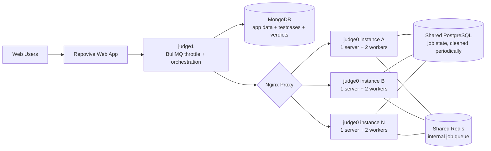
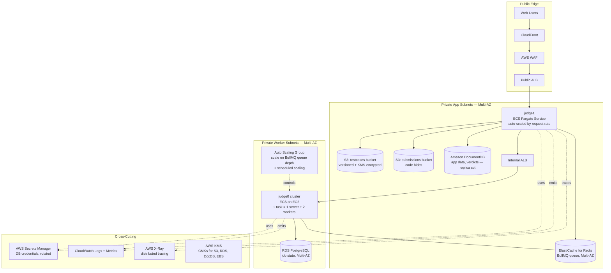
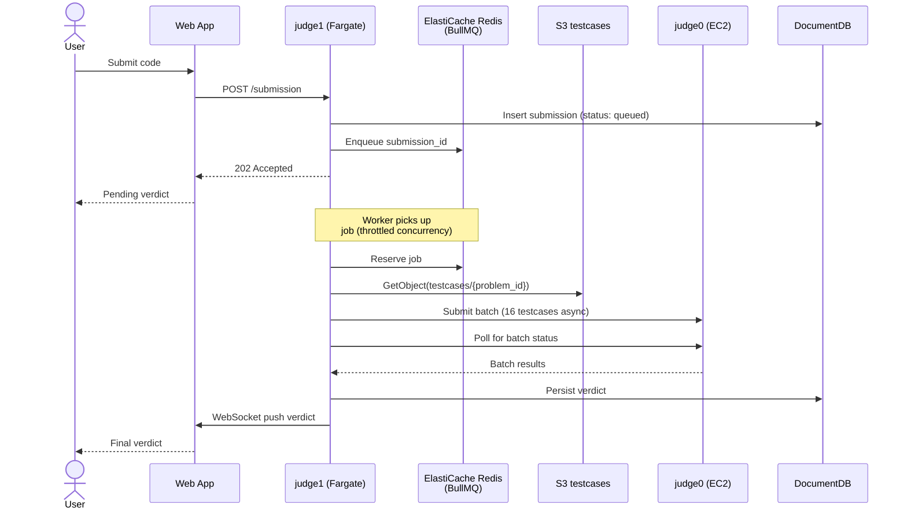
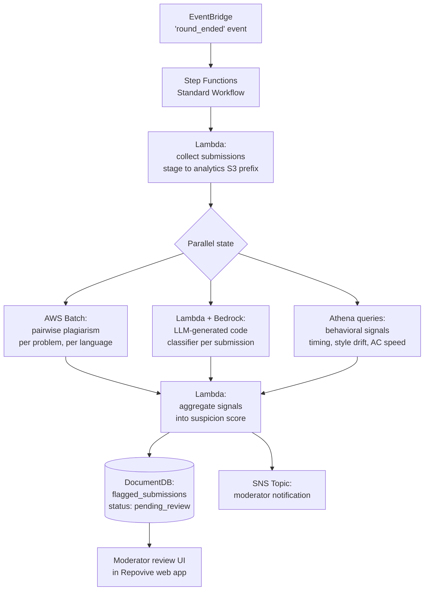
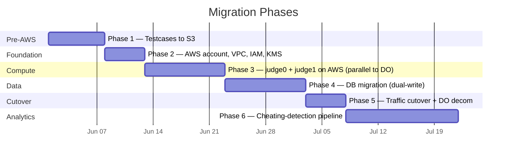

# Repovive Judge — AWS Migration Proposal

> Migrating the Repovive competitive programming judge from DigitalOcean + MongoDB to AWS, with a future-state post-round cheating-detection pipeline.

**Author:** Shayan Chashm Jahan
**Status:** Draft proposal
**Audience:** Repovive engineering team (internal), Manara AWS SAA reviewer (external)

---

## 1. Executive Summary

The Repovive judge stack — a custom orchestration layer (`judge1`) sitting on top of a horizontally-scaled `judge0` cluster — currently runs on DigitalOcean with all data, including test cases, in a single MongoDB instance. The setup works but has three structural problems: test cases living in MongoDB cause cost and performance pressure that grows with the problem set; pre-round scaling is a manual ritual ("3 clicks") that does not survive surprise load; and there is no story for cross-AZ resilience, end-to-end tracing, or post-round analytics.

This proposal migrates the stack to AWS in five phases, keeps the existing `judge0` and `judge1` codebases largely intact, and adds a sixth phase that introduces a post-round cheating-detection pipeline (plagiarism, LLM-generated code, behavioral signals) built on Step Functions, AWS Batch, and Amazon Bedrock.

The keystone of the migration is moving test cases out of MongoDB into S3 — a change that can be made **before** any AWS infrastructure is provisioned, which de-risks the rest of the plan.

---

## 2. Current State

### 2.1 Architecture



The flow for a single submission:

1. Web app POSTs a submission to `judge1`.
2. `judge1` enqueues the submission to a BullMQ queue backed by Redis. BullMQ throttles concurrency so we don't OOM `judge0` containers.
3. A `judge1` worker pulls the submission, fetches test cases from MongoDB, and splits them into batches of 16.
4. Each batch is sent to a `judge0` server (round-robined by Nginx) as an async job with the compiled binary.
5. `judge1` polls `judge0` for completion of each batch.
6. Final verdict is written back to MongoDB and surfaced to the web app.

Operationally, `judge0` instances are deployed manually before contests using an in-house "3-click" scaling tool that provisions additional DigitalOcean droplets and updates Nginx.

### 2.2 Pain Points

**Test cases in MongoDB.** This is the single biggest issue. MongoDB has a 16 MB BSON document cap, large-document reads are slow, IOPS scale linearly with cost, and there is no CDN or lifecycle story. Test cases are large, immutable, read-heavy blobs — the textbook S3 use case.

**Manual scaling.** The 3-click scale-up is fast but it is still a human-in-the-loop and assumes we know the contest's load curve in advance. A surprise traffic spike (a problem going viral, a public class assignment, an unscheduled load test) is not handled.

**Ops burden of N nginx-fronted instances.** As `N` grows, the chance of configuration drift between droplets grows linearly. There is no central control plane.

**No observability.** We have basic process metrics, but no distributed tracing across `judge1` → BullMQ → `judge0` → Postgres, so root-causing a slow submission is guesswork.

**No disaster-recovery posture.** A datacenter incident at the current provider takes the whole platform offline. There is no Multi-AZ story for MongoDB, Postgres, or Redis.

**Postgres cleanup is a chore.** Periodic cleanup of the `judge0` job state runs on a host-cron and breaks silently.

---

## 3. Goals & Non-Goals

**Goals**

- Move test cases out of MongoDB into purpose-built object storage.
- Replace manual pre-round scaling with automated scaling driven by queue depth and contest schedule.
- Establish Multi-AZ resilience for every stateful component.
- Add distributed tracing and centralized logging.
- Build a foundation for post-round ML analytics (cheating detection).
- Keep the `judge0` and `judge1` codebases largely unchanged — this is a platform migration, not a rewrite.

**Non-goals**

- Rewriting `judge0` or replacing it with a custom executor.
- Real-time cheating detection during contests (post-round is sufficient and far cheaper).
- Multi-region active-active. Single region, Multi-AZ is the right target for our user base and budget.
- Migrating off BullMQ. BullMQ on ElastiCache Redis is a clean port.

---

## 4. Target Architecture

### 4.1 Overview



### 4.2 Single-Submission Flow



### 4.3 Component-by-Component Breakdown

**`judge1` — ECS Fargate behind a public ALB.** No privileged-container requirements, so Fargate is the right choice. Auto-scales on request rate (target tracking on `ALBRequestCountPerTarget`). Each task pulls from BullMQ at the throttled rate, retrieves test cases from S3, and orchestrates `judge0` calls. Logs and traces flow to CloudWatch and X-Ray respectively.

**`judge0` cluster — ECS on EC2.** This is the most important architectural decision in the proposal: `judge0` uses `isolate` for sandboxing untrusted user code, which requires cgroups and privileged container access. **AWS Fargate does not support privileged mode**, so `judge0` workers must run on EC2 (via the ECS EC2 launch type, or a plain ASG-managed fleet). Each ECS task mirrors today's deployment: 1 `judge0` server + 2 workers. The fleet sits behind an *internal* ALB that replaces Nginx. The ASG is driven by two scaling signals: a scheduled action that scales up 15 minutes before any known contest, and a target-tracking policy on a custom CloudWatch metric — BullMQ queue depth — that handles surprise load. Spot capacity is a strong fit for workers (a killed instance simply re-queues its in-flight batch), and is recommended for cost optimization once the migration stabilizes.

**ElastiCache for Redis — Multi-AZ.** Drop-in replacement for the current Redis used by BullMQ. Cluster mode disabled is fine for our scale; enable automatic failover and Multi-AZ. BullMQ code in `judge1` does not change.

**Amazon DocumentDB — app data, replica set.** MongoDB-compatible drop-in for the application data layer (problems metadata, users, submissions, verdicts). Application code is unchanged. The one caveat — DocumentDB is not feature-complete with MongoDB — is handled explicitly in §6.

**Amazon S3 — test cases and submission code, two buckets.**
The `repovive-testcases` bucket is keyed by `{problem_id}/{testcase_id}.{in|out}`, versioned, KMS-encrypted, with a lifecycle rule to transition cold problems to S3 Intelligent-Tiering.
The `repovive-submissions` bucket is keyed by `{contest_id}/{user_id}/{submission_id}.{ext}` and stores the user-submitted source. DocumentDB stores metadata pointing to the S3 object. This separation is the precondition for the cheating-detection pipeline in §5.

**RDS PostgreSQL — Multi-AZ.** Hosts `judge0`'s internal job state. Multi-AZ for automatic failover. The cleanup cron becomes an EventBridge schedule firing a Lambda — same logic, no host to maintain.

**Networking.** Single VPC, three subnet tiers across two AZs: public (ALB only), private app (`judge1`), private workers (`judge0`, ElastiCache, RDS, DocumentDB). NAT Gateway for outbound updates only. Security groups follow least-privilege: only `judge1` can reach BullMQ and the internal `judge0` ALB; only `judge0` can reach RDS Postgres; both can reach DocumentDB and S3 (via gateway endpoint).

**Security.** AWS WAF on the public ALB with rate-based rules and the AWS Managed Common Rule Set. Secrets Manager for all DB credentials with rotation enabled. KMS customer-managed keys for S3, RDS, DocumentDB, and EBS. CloudTrail enabled across the account. GuardDuty enabled for threat detection (low-effort, high-signal).

---

## 5. Post-Round Analytics: Cheating Detection Pipeline

This is Phase 6 of the migration — it lights up after the core platform is on AWS and S3 contains submission code. The pipeline runs **once per round** on the round's completed submissions and produces a moderator review queue.

### 5.1 Pipeline Architecture



### 5.2 Trigger and Orchestration

Round-end is an application-level event. When the web app marks a round as completed, it puts a `round_ended` event on a custom EventBridge bus. An EventBridge rule matches this event and starts a Step Functions Standard Workflow execution with the round ID as input. Step Functions Standard (not Express) is correct here — these executions take minutes to tens of minutes and we want the full execution history for auditability.

### 5.3 Signals

**Plagiarism — pairwise code similarity.** For each (problem, language) pair in the round, compute a similarity matrix across all submissions using a tokenized-AST approach (the MOSS algorithm and its open-source descendants are well-suited). This is N² per problem, which for typical contest sizes (hundreds of submissions per problem, occasionally low thousands) is comfortably handled by a single AWS Batch job using an EC2 compute environment. Output: pairs of submissions with similarity above a tunable threshold, written to S3 as Parquet.

**LLM-generated code detection.** For each submission, a Lambda invokes Amazon Bedrock with a carefully prompted Claude (or Llama) model and a structured-output schema asking for an LLM-probability score and a short rationale. Bedrock is the right starting point because it removes the need to host a model and lets us iterate on the prompt in days, not weeks. If per-round inference cost becomes a concern at scale, the migration path is to a SageMaker-hosted classifier — covered in §6.

**Behavioral signals.** A nightly Glue job partitions the submissions and verdicts in S3 by date, problem, and user. Athena queries then produce per-submission flags: anomalously fast first-AC on a hard problem, sudden style change vs the user's submission history, identical edit-time patterns across multiple users, and so on. These are cheap, deterministic SQL signals — they should never be the only basis for action, but they're useful priors.

### 5.4 Aggregation and Review

A final Lambda reads all three signal streams from S3, combines them into a per-submission suspicion score (weighted sum with weights as configuration, not code), and writes flagged submissions to a `flagged_submissions` collection in DocumentDB with status `pending_review`. An SNS topic notifies the moderator team via email and (optionally) a Slack webhook.

Moderators review flagged submissions in a dedicated page in the Repovive web app, with the full code, similarity matches, LLM-detection rationale, and behavioral signals shown side-by-side. The moderator action (confirm, dismiss, escalate) is the ground-truth label that, over time, feeds back into a fine-tuned classifier — but that's a future iteration.

---

## 6. Key Design Decisions

These are the architectural decisions where a defensible choice matters more than the choice itself. Each is documented with options, choice, and rationale — the form an SAA exam item would test.

**6.1 Fargate vs ECS-on-EC2 for `judge0` workers.**
Options: Fargate, ECS-on-EC2, EKS, raw EC2 ASG.
Choice: **ECS-on-EC2.**
Rationale: `judge0` requires the `isolate` sandbox, which needs cgroups and privileged container capabilities. Fargate does not allow privileged mode, ruling it out. EKS would work but adds an operational layer we don't need at our scale. Raw EC2 ASG would work but ECS gives us declarative task definitions and rolling deploys for free. `judge1` itself has no such constraint and runs on Fargate.

**6.2 Amazon DocumentDB vs MongoDB Atlas on AWS.**
Options: DocumentDB, MongoDB Atlas (AWS-hosted), self-hosted MongoDB on EC2.
Choice: **DocumentDB initially**, with Atlas as a defined fallback.
Rationale: DocumentDB is MongoDB-compatible up to a specific API version and integrates natively with the rest of the AWS account (IAM, VPC, KMS, CloudWatch). Atlas is a more capable database with full MongoDB feature parity, but it is a separate vendor relationship, separate IAM, separate billing. **Verification action**: before committing, audit current MongoDB usage for transactions, change streams beyond simple watches, and any feature past DocumentDB's compatibility version. If anything blocks, switch to Atlas. Self-hosting is rejected — we are explicitly trying to *exit* the "manage our own database" business.

**6.3 Spot vs On-Demand for `judge0` workers.**
Options: 100% On-Demand, mixed (On-Demand baseline + Spot for surge), 100% Spot.
Choice: **Mixed.** On-Demand for the steady baseline (1–2 instances), Spot for surge during contests.
Rationale: A killed `judge0` worker has a self-healing failure mode — the in-flight batch is simply re-queued by `judge1`'s timeout-and-retry logic — so Spot's interruption risk is tolerable. Cost savings are typically 50–70%. Keeping a small On-Demand baseline prevents Spot capacity unavailability from breaking idle-period traffic.

**6.4 Polling vs webhooks for `judge0` completion.**
Options: Keep polling, switch to `judge0` webhooks.
Choice: **Keep polling for the migration; revisit later.**
Rationale: Polling works today, it is well-understood, and changing it during a platform migration introduces unnecessary risk. Once stable on AWS, replacing the poll loop with `judge0` callbacks to an API Gateway endpoint would reduce latency and load on the BullMQ queue — flagged as future work.

**6.5 Bedrock vs SageMaker for LLM-generated code detection.**
Options: Amazon Bedrock (fully managed FM inference), SageMaker real-time endpoint, SageMaker batch transform.
Choice: **Bedrock for the first version, batch transform for scale.**
Rationale: Bedrock removes model hosting from the operational burden entirely and lets us iterate on the prompt and grader without retraining. Per-inference cost is higher than a self-hosted classifier, but at our submission volume (post-round, batch-able), this is acceptable for v1. The migration path to SageMaker batch transform (using a fine-tuned model trained on moderator-labeled examples) is clean and warranted only if Bedrock costs cross a threshold we define in advance.

**6.6 Real-time vs post-round cheating detection.**
Options: Block at submission time, flag at submission time, flag post-round.
Choice: **Flag post-round.**
Rationale: Real-time blocking has unacceptable false-positive risk (an honest submission that resembles a known cheating pattern would be denied AC). Real-time flagging adds latency to the verdict path. Post-round runs on the full submission set in batch, supports more expensive signals (pairwise N² plagiarism), and gives moderators a curated queue rather than an alert stream.

---

## 7. Migration Plan



Each phase is independently rollback-able. The plan is structured so that the highest-value, lowest-risk work happens first.

**Phase 1 — Test cases out of MongoDB into S3.** This phase is done **while still on DigitalOcean**. We provision a single AWS account, create the `repovive-testcases` S3 bucket, write a one-time migration script to dump test cases from MongoDB and upload them to S3 with the agreed key structure, and modify `judge1`'s test-case loader to fetch from S3 by `problem_id`. Feature-flag the change so we can flip back to Mongo instantly. Success criterion: judge1 reads 100% of test cases from S3 for 7 consecutive days with no MongoDB fallback. Rollback: flip the feature flag.

**Phase 2 — AWS foundation.** Provision the VPC (three subnet tiers across two AZs), Transit Gateway is not needed (single VPC), NAT Gateway, IAM roles for ECS tasks and Lambda, KMS CMKs, Secrets Manager entries (initially placeholder), CloudWatch log groups, S3 buckets for `submissions` and `analytics`. All via CloudFormation (or Terraform — choose one and stick with it). Success criterion: `cfn-lint`-clean templates applied to a fresh account. Rollback: stack delete.

**Phase 3 — `judge0` and `judge1` on AWS, running in parallel.** Stand up the ECS-on-EC2 `judge0` cluster, the Fargate `judge1` service, ElastiCache Redis, RDS Postgres. The web app continues to send all real traffic to DigitalOcean. We shadow a percentage of submissions to the AWS stack and compare verdicts to catch any subtle differences (`isolate` version skew, compiler version skew, etc.). Success criterion: 10,000 shadowed submissions with 100% verdict parity. Rollback: stop the shadow traffic — the production path is untouched.

**Phase 4 — Database migration (DocumentDB) with dual-write.** Modify `judge1` and the web app to dual-write all new submissions and verdicts to both MongoDB (DO) and DocumentDB (AWS). Run a one-time backfill of historical app data using `mongodump`/`mongorestore`. Run an end-to-end consistency check across both databases for 7 days. Success criterion: zero divergence between the two stores for 7 consecutive days. Rollback: disable the DocumentDB write path; DO MongoDB remains canonical.

**Phase 5 — Traffic cutover and DO decommissioning.** Update DNS to point to the AWS public ALB. Keep DocumentDB and MongoDB in sync for one additional week as a safety net, then cut writes to MongoDB. Once the week is clean, decommission DigitalOcean droplets and the legacy MongoDB instance. Success criterion: AWS handles 100% of traffic for 7 days with SLOs met. Rollback: DNS flip back.

**Phase 6 — Cheating-detection pipeline.** Build out the Step Functions workflow, Bedrock-based LLM detector, AWS Batch plagiarism job, Glue/Athena behavioral pipeline, and moderator review UI in the web app. Run shadow on the last three completed rounds with no notifications enabled, calibrate the suspicion-score weights against moderator-labeled ground truth, then enable notifications. Success criterion: precision of flagged-and-confirmed-cheating > 80% on a held-out test round.

---

## 8. Cost Model

These are order-of-magnitude estimates assuming a single region (e.g., `eu-west-1` or `us-east-1`), moderate baseline traffic, and 2–4 contests per month. Refine with actual usage data before committing.

**Steady state (no active contest), monthly:**

| Component | Configuration | ~Monthly cost |
|---|---|---|
| `judge1` Fargate | 2 tasks, 0.5 vCPU each | $15 |
| `judge0` EC2 baseline | 2× t3.medium (On-Demand) | $60 |
| ALBs (public + internal) | 2 ALBs | $40 |
| ElastiCache Redis | cache.t3.small, Multi-AZ | $35 |
| RDS PostgreSQL | db.t3.small, Multi-AZ | $55 |
| DocumentDB | db.t3.medium × 2 instances | $180 |
| S3 storage | ~100 GB testcases + submissions | $3 |
| NAT Gateway | 1 | $35 |
| CloudWatch + X-Ray | Logs and traces | $25 |
| WAF | Rules + requests | $20 |
| **Steady-state total** | | **~$470/month** |

**During a contest (4-hour window):**

| Component | Marginal cost |
|---|---|
| Additional `judge0` EC2 Spot instances (10×) | $5–15 per contest |
| `judge1` Fargate scale-up | $1–3 per contest |

**Per-round cheating-detection cost:**

| Component | Marginal cost |
|---|---|
| Bedrock invocations (~5,000 submissions/round) | $20–80 per round |
| AWS Batch (plagiarism, 30–60 min compute) | $3–10 per round |
| Step Functions + Lambda + Athena | <$1 per round |

The Spot strategy for `judge0` workers is the single largest cost lever — switching the contest-time surge fleet from On-Demand to Spot is roughly a 60% reduction on that line item.

---

## 9. Well-Architected Framework Mapping

**Operational Excellence.** All infrastructure as code (CloudFormation or Terraform). Centralized logging in CloudWatch. Distributed tracing in X-Ray. Runbooks for failover and rollback at each migration phase. Step Functions execution history provides full auditability for the cheating-detection pipeline.

**Security.** Defense-in-depth: WAF at the edge, ALB in public subnet only, all compute and data in private subnets, security groups with least-privilege rules, IAM task roles scoped per service, Secrets Manager for credentials with rotation, KMS CMKs for all data at rest, CloudTrail across the account, GuardDuty for threat detection, S3 bucket policies that deny non-TLS access.

**Reliability.** Multi-AZ for every stateful service (RDS, DocumentDB, ElastiCache). ASG ensures `judge0` workers self-heal. ECS service definitions ensure `judge1` tasks self-heal. SQS-style retry semantics in BullMQ handle transient `judge0` failures. Health checks at the ALB ensure unhealthy tasks are removed from rotation. Phased migration with rollback at each step.

**Performance Efficiency.** Right-sized compute per workload (Fargate for stateless `judge1`, EC2 for sandboxed `judge0`). Auto-scaling driven by the most relevant signal (queue depth, not CPU). S3 + CloudFront-ready test case delivery. DocumentDB read replicas for verdict-fetch traffic. X-Ray to identify and remove latency hotspots.

**Cost Optimization.** Spot for `judge0` surge. Scale-to-near-zero between contests (baseline of 1–2 instances). S3 Intelligent-Tiering for cold testcases. Scheduled scaling kills idle capacity outside contest windows. Bedrock pay-per-invocation matches the bursty, post-round inference workload.

**Sustainability.** Scale-to-near-zero between contests directly reduces idle energy use. Spot is filling otherwise-wasted capacity. Single-region is appropriate for our user distribution and avoids over-provisioning.

---

## 10. Risks and Mitigations

**DocumentDB feature gap.** Risk: an unsupported MongoDB feature is in production use and the migration cannot proceed. Mitigation: explicit audit in Phase 4 pre-work; defined fallback to MongoDB Atlas with the same migration mechanics.

**`isolate` version skew between DO and AWS.** Risk: a submission that compiles or runs on DO fails on AWS due to subtle sandbox-version differences. Mitigation: 10,000-submission shadow comparison in Phase 3 specifically targets this class of bug.

**Bedrock cost surprise on a high-volume round.** Risk: a viral round produces 100K submissions and the LLM-detection bill spikes. Mitigation: per-round cost budget alarm; fall back to sampling (random subset + always-evaluate-AC subset) when budget is exceeded.

**Spot interruption during a contest.** Risk: Spot fleet termination during a round causes verdict delays. Mitigation: On-Demand baseline absorbs interruptions; `judge1`'s timeout-and-retry re-queues in-flight batches; capacity-optimized Spot allocation strategy reduces interruption rate.

**Single-region failure.** Risk: a region-wide AWS event takes us offline. Mitigation: accepted risk for v1, given our user base. Future work to add cross-region async replication of S3 buckets and DocumentDB snapshots for a "warm cold" DR posture (RTO measured in hours, not minutes).

---

## 11. Future Work

- `judge0` callback webhooks to replace polling.
- SageMaker batch transform replacing Bedrock once labeled data is sufficient.
- Cross-region S3 replication + scheduled DocumentDB snapshots for DR (Pilot Light pattern).
- Moderator-labeled feedback loop training a Repovive-specific cheating classifier.
- QuickSight dashboards on the analytics bucket for staff visibility into round health, flag rates, and language distribution.

---

## 12. Appendix

### 12.1 Service Inventory

| Layer | Service | Purpose |
|---|---|---|
| Edge | CloudFront, AWS WAF | Caching, DDoS, OWASP rules |
| Load balancing | Application Load Balancer | L7 routing, health checks |
| Compute (app) | ECS Fargate | `judge1` orchestration layer |
| Compute (workers) | ECS on EC2 + ASG | `judge0` sandboxed execution |
| Queue | ElastiCache for Redis | BullMQ backing store |
| Database (app) | Amazon DocumentDB | Mongo-compatible app data |
| Database (job state) | RDS PostgreSQL | `judge0` internal state |
| Object storage | Amazon S3 | Test cases, submissions, analytics |
| Orchestration | AWS Step Functions | Cheating-detection pipeline |
| Batch compute | AWS Batch | Plagiarism N² jobs |
| Analytics | AWS Glue, Amazon Athena | Behavioral signal queries |
| ML inference | Amazon Bedrock | LLM-generated code detection |
| Identity | AWS IAM | Roles, policies, boundaries |
| Secrets | AWS Secrets Manager | DB credentials with rotation |
| Encryption | AWS KMS | Customer-managed keys |
| Observability | CloudWatch, X-Ray | Logs, metrics, traces |
| Security | GuardDuty, CloudTrail | Threat detection, audit |
| Eventing | Amazon EventBridge | Round-ended trigger |
| Notification | Amazon SNS | Moderator alerts |

### 12.2 Sample BullMQ-Queue-Depth Scaling Signal

A small sidecar Lambda runs every minute, reads the BullMQ "waiting" count from ElastiCache, and publishes it as a custom CloudWatch metric `Repovive/judge1/QueueDepth`. The `judge0` ECS service then uses a target-tracking scaling policy on this metric with a target value (e.g., 50 waiting jobs per running task). This replaces the manual 3-click scale-up entirely.

### 12.3 Sample Bedrock Prompt Structure (LLM Detection)

The Lambda invokes Bedrock with the user's code and a system prompt that asks for a structured response:

```
You are a competitive-programming code reviewer. Given a code submission,
evaluate whether the code shows characteristics of being generated by a
large language model rather than written by a competitive programmer.
Consider style consistency, idiomatic vs verbose patterns, comment density
and tone, variable naming, and structural over-engineering for the
problem's difficulty.

Return JSON: { "llm_probability": 0.0..1.0, "rationale": "short string" }
```

The structured output is parsed by the Lambda and persisted alongside other signals.

---

*End of proposal.*
