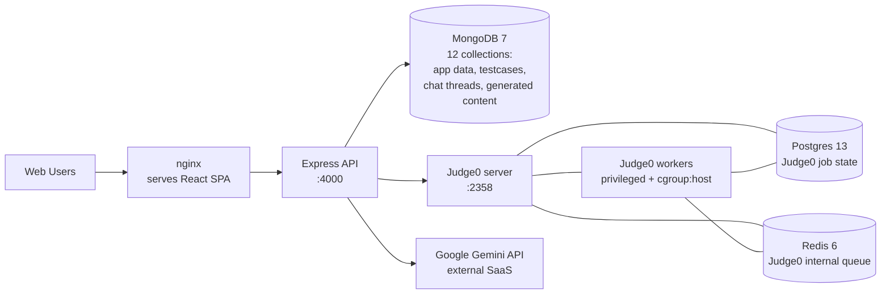
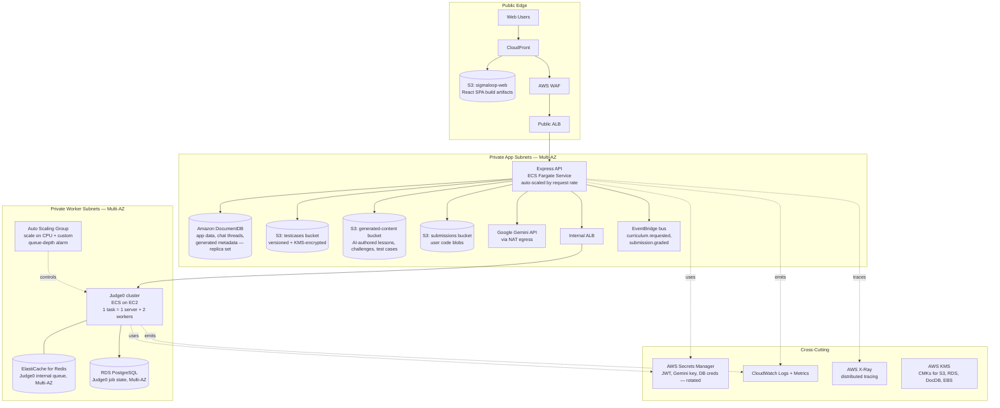
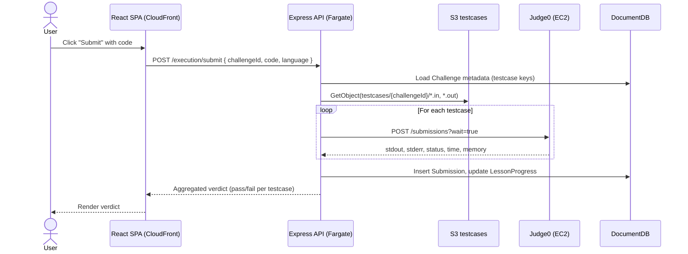
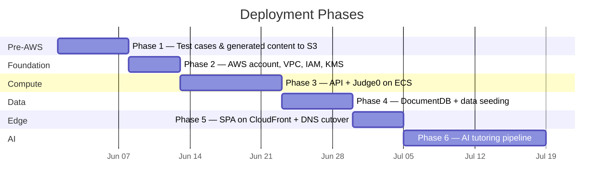

# SigmaLoop — AWS Hosting Proposal

> Hosting the SigmaLoop personalized-learning platform on AWS, with a Judge0-backed code execution path and a Gemini-backed AI tutoring pipeline (mentor chat, per-user curriculum generation, programming and math grading).

**Author:** Hamza Mohammed Hassanain
**Status:** Draft proposal
**Audience:** SigmaLoop engineering team

---

## 1. Executive Summary

SigmaLoop is a personalized-learning platform — "Master the Logic behind the Code" — that combines a structured **Course → Lesson → Challenge** hierarchy with an **AI tutor** that converses with the student, deduces what they need to learn, and then *generates* a curriculum (lessons, challenges, test cases, math problems) tailored to that individual. The platform is a judge in the technical sense — it executes user-submitted code in a sandbox and grades it — but it is **not** a contest platform. The traffic profile is a classroom, not a leaderboard.

Today the entire stack runs as `docker-compose` on a single host: a React/Vite SPA served by nginx, an Express + MongoDB API, a Judge0 cluster (server + workers + Postgres + Redis) for sandboxed execution, and external Gemini API calls for the AI features. The setup works for development but offers no multi-AZ resilience, no autoscaling, no managed-database story, no CDN for the SPA, and no infrastructure for the AI generation pipeline beyond synchronous API calls inside the request path.

This proposal moves the platform to AWS in six phases, keeps the existing application codebases largely intact, and adds a **Phase 6 AI tutoring pipeline** built on EventBridge, Step Functions, and Lambda that produces personalized curricula and grades both programming submissions (via Judge0) and mathematical submissions (via a Gemini-backed LaTeX grader).

The keystone of the migration is **moving test cases and AI-generated content out of MongoDB into S3** — a change that can be made *before* any AWS infrastructure is provisioned, which de-risks the rest of the plan and unlocks the curriculum-generation pipeline as a separable component.

---

## 2. Current State

### 2.1 Architecture



The flow for a single submission:

1. The React SPA POSTs the user's code and a `challengeId` to `POST /api/v1/execution/submit`.
2. The Express controller reads the challenge document from MongoDB (including the embedded test cases) and, for each test case, calls `POST /submissions?wait=true` against the Judge0 server.
3. Results are aggregated in-process and a verdict is returned synchronously in the HTTP response.
4. AI mentor chat and AI generation routes call the Gemini SDK directly from the controller, then persist the result to MongoDB (`ChatMessage`, `GeneratedCourse`, `GeneratedLesson`, `GeneratedChallenge`).

Operationally, the entire stack runs on one host via two `docker-compose` files (`docker-compose.yml` for API + MongoDB, `docker-compose.judge0.yml` for the execution engine).

### 2.2 Pain Points

**Test cases and generated content in MongoDB.** Every `Challenge` document embeds its test-case payload, and every `GeneratedChallenge` likewise. As soon as the AI generation pipeline runs at any volume, the database fills with large, immutable, read-heavy blobs. MongoDB's 16 MB document cap is a hard ceiling; large-document reads are slow; there is no CDN or lifecycle story. This is the textbook S3 use case.

**Single host, no resilience.** A single Docker host means a single AZ, single power supply, single network path. Any outage is a full outage. Stateful volumes (`mongo_data`, `judge0-postgres-data`, `judge0-redis-data`) live on local disk with no managed backups.

**Synchronous AI calls in the request path.** Both mentor chat and AI generation invoke Gemini synchronously inside the Express controller. A 20-second curriculum-generation call ties up an HTTP worker, blocks the event loop on JSON parsing of a large response, and offers no retry, no batching, and no cost ceiling.

**No CDN for the SPA.** The Vite-built React app is served by an in-cluster nginx. Every user pays full-origin latency for every static asset. Asset caching is configured but invalidation is manual and globally coarse.

**No observability.** Process logs go to container stdout. There is no centralized log store, no distributed trace across `API → Judge0 → Gemini`, no metric on Gemini token spend, and no alarm on Judge0 worker pool exhaustion.

**Secrets in env files.** `JWT_SECRET`, `GEMINI_API_KEY`, MongoDB and Judge0 credentials live in `.env` files on disk with no rotation, no audit trail, and no per-service IAM scoping.

**No environment separation.** There is no staging environment. Changes to the AI generation prompts, the Judge0 language matrix, or the data schema are validated only against the developer's laptop.

---

## 3. Goals & Non-Goals

**Goals**

- Move test cases and AI-generated content out of MongoDB into purpose-built object storage.
- Run Judge0 on AWS with the privileged-mode and cgroups support that `isolate` requires.
- Front the React SPA with a CDN and isolate it from the API's compute footprint.
- Establish Multi-AZ resilience for every stateful component.
- Move the AI generation pipeline out of the request path and into an asynchronous, observable, cost-bounded workflow.
- Add distributed tracing and centralized logging across the API, Judge0, and the AI pipeline.
- Keep the existing Express, React, and Judge0 codebases largely unchanged — this is a platform deployment, not a rewrite.

**Non-goals**

- Building a contest platform. SigmaLoop is per-user learning; we explicitly do **not** need leaderboards, contest rounds, anti-cheat adjudication, or BullMQ-style queue throttling.
- Real-time AI grading at submission time for programming. Judge0 already gives us deterministic grading; the AI's role is to *generate* the challenges and test cases, not to grade each submission in real time.
- Multi-region active-active. Single region, Multi-AZ is the right target for our user base and budget.
- Migrating off Gemini. We chose Gemini deliberately for its long-context structured-output performance on curriculum generation. Bedrock is documented as a defined fallback in §6, not a goal.
- Replacing Judge0 with a custom executor.

---

## 4. Target Architecture

### 4.1 Overview



### 4.2 Single Programming-Submission Flow



### 4.3 Component-by-Component Breakdown

**React SPA — S3 + CloudFront.** The Vite build output is uploaded to a private S3 bucket and served via CloudFront with Origin Access Control. The same distribution fronts AWS WAF and a custom domain (ACM cert). SPA routing is handled by a CloudFront Function that rewrites `404 → /index.html`, replacing the current `nginx.conf` fallback rule. Asset caching uses Vite's content-hashed filenames, so cache invalidation is implicit on every deploy except for `index.html`, which is invalidated as part of the deploy step.

**Express API — ECS Fargate behind a public ALB.** The API has no privileged-container requirements, so Fargate is the right choice. Each task runs the existing `Backend/Dockerfile` unchanged. Auto-scales on `ALBRequestCountPerTarget` with a target value chosen against load tests. Tasks run in the private app subnets across two AZs; the ALB is the only public-subnet resource on the API side. Logs and traces flow to CloudWatch and X-Ray respectively.

**Judge0 cluster — ECS on EC2.** This is the most important architectural decision in the proposal: Judge0 uses `isolate` for sandboxing untrusted user code, which requires cgroups and privileged container access. **AWS Fargate does not support privileged mode**, so Judge0 workers must run on EC2 (via the ECS EC2 launch type). Each ECS task mirrors today's deployment: one Judge0 server task plus a Judge0 workers task with `COUNT=4`. The fleet sits behind an *internal* ALB so the API can address the cluster without touching the public internet. The ASG is driven by two scaling signals: CPU utilization (primary), and a custom CloudWatch metric `SigmaLoop/judge0/PendingSubmissions` (secondary), giving us alarm-driven scale-out without the operational weight of a contest-style queue depth ladder. Baseline is two `t3.medium` instances; the alarm scales to a ceiling of six.

**ElastiCache for Redis — Multi-AZ.** This Redis instance is Judge0's *internal* job queue (Judge0 uses Resque under the hood). It is **not** an application-level queue — the SigmaLoop API has no BullMQ. Cluster mode disabled, automatic failover and Multi-AZ enabled.

**Amazon DocumentDB — application data, replica set.** MongoDB-compatible drop-in for SigmaLoop's twelve Mongoose collections (users, courses, lessons, challenges, enrollments, lesson progress, submissions, chat threads, chat messages, generated courses, generated lessons, generated challenges). Mongoose application code is unchanged. The caveat — DocumentDB is not feature-complete with MongoDB — is handled explicitly in §6 with a Phase 4 audit and a defined fallback to MongoDB Atlas.

**Amazon S3 — three purpose-specific buckets.**
- `sigmaloop-testcases` — keyed by `{challengeId}/{testcaseIndex}.{in|out}`, versioned, KMS-encrypted. Replaces the embedded test-case payloads on the `Challenge` document.
- `sigmaloop-generated-content` — keyed by `{generatedCourseId}/{lessonId}/challenges/{challengeId}.json`. Stores the AI-authored lesson body, challenge prompt, and per-language test cases produced by the curriculum pipeline (§5). DocumentDB stores only the metadata and the S3 keys.
- `sigmaloop-submissions` — keyed by `{userId}/{submissionId}.{ext}`. Stores user-submitted source code. DocumentDB stores metadata pointing to the S3 object. Useful for the future "submission history" view and as a foundation for analytics.

**RDS PostgreSQL — Multi-AZ.** Hosts Judge0's internal job-state database. Multi-AZ for automatic failover. Required because Judge0 needs Postgres; not used by the SigmaLoop application code itself.

**Gemini access.** The application calls the Gemini API directly over HTTPS via the NAT Gateway. The API key is stored in AWS Secrets Manager and injected into the task at startup. There is no AWS-native Gemini equivalent; if we ever need to migrate to a fully-AWS-resident model, the path is Amazon Bedrock with a Claude or Llama model (see §6).

**Networking.** Single VPC, three subnet tiers across two AZs: public (ALBs only), private app (API tasks), private workers (Judge0 tasks, ElastiCache, RDS, DocumentDB). NAT Gateway for outbound Gemini calls and image pulls. S3 access via gateway endpoint to avoid NAT cost on object reads. Security groups follow least-privilege: only the API can reach the internal Judge0 ALB and DocumentDB; only Judge0 can reach RDS Postgres and the Judge0 Redis; both can reach S3 via the gateway endpoint.

**Security.** AWS WAF on the CloudFront distribution and the public ALB with rate-based rules and the AWS Managed Common Rule Set. Secrets Manager for all credentials with rotation enabled (JWT signing key rotation is a careful operation — documented separately). KMS customer-managed keys for S3, RDS, DocumentDB, and EBS. CloudTrail enabled across the account. GuardDuty enabled for threat detection.

---

## 5. The AI Tutoring Pipeline

This is Phase 6 of the deployment — it lights up after the core platform is on AWS and S3 is the canonical home for generated content. The pipeline is the headline feature of SigmaLoop: a personalized tutor that converses with the student, deduces what they need, and then *generates* a curriculum of lessons, challenges, and graders specifically for that student.

### 5.1 Pipeline Architecture

```mermaid
flowchart TB
    User[Student in SPA] --> ChatAPI[Express:<br/>POST /chat/messages]
    ChatAPI --> Gemini1[Gemini: mentor chat<br/>scope: GENERAL/COURSE/LESSON]
    Gemini1 --> ChatAPI
    ChatAPI --> DDB1[(DocumentDB:<br/>ChatThread + ChatMessage)]
    ChatAPI -.on intent: "build me a course".-> EB[EventBridge:<br/>curriculum.requested]

    EB --> SF[Step Functions<br/>Standard Workflow:<br/>generate-curriculum]
    SF --> L1[Lambda: deduce-needs<br/>summarize chat history<br/>to a learning-goals JSON]
    L1 --> L2[Lambda: generate-course<br/>Gemini structured output:<br/>course outline + lesson list]
    L2 --> Fork{Map state<br/>per lesson}
    Fork --> L3[Lambda: generate-lesson<br/>Gemini: markdown body<br/>+ challenge specs]
    L3 --> L4[Lambda: generate-challenge<br/>Gemini: problem statement<br/>+ test cases + reference solution]
    L4 --> S3G[(S3 generated-content:<br/>lesson.md + challenge.json + testcases/)]
    L4 --> DDB2[(DocumentDB:<br/>GeneratedCourse/Lesson/Challenge<br/>metadata + S3 keys)]
    DDB2 --> SPA2[SPA polls /ai/jobs/:id<br/>or receives push notification]

    subgraph Grading["Grading paths"]
        SubProg[Programming submission] --> J0G[Judge0 sandbox<br/>runs AI-generated test cases]
        SubMath[Math submission &mdash; LaTeX] --> LMath[Lambda: grade-math<br/>Gemini: verify LaTeX<br/>vs problem statement]
    end
```

### 5.2 The Mentor Chat (Synchronous)

The mentor chat is the entry point. It is a thin synchronous wrapper around Gemini, scoped to one of three contexts (`GENERAL`, `COURSE`, `LESSON`) so the model receives only the relevant lesson body or course outline as context. Each user turn is persisted to a `ChatThread` / `ChatMessage` in DocumentDB. This part of the pipeline does **not** sit behind Step Functions because conversational latency matters — sub-second time-to-first-token is the goal — and the API handles it directly. CloudWatch metrics emit per-thread token spend so a runaway thread can be flagged or capped.

When the model detects (or is asked) "build me a course about X for someone at level Y," the API does not block on generation. Instead it persists a `GeneratedCourse` document in `PENDING` state and emits a `curriculum.requested` event to a custom EventBridge bus. The chat returns a "your curriculum is being generated" message immediately.

### 5.3 Curriculum Generation (Asynchronous, Step Functions)

An EventBridge rule matches `curriculum.requested` and starts a Step Functions Standard Workflow. Standard (not Express) is correct here — these executions take minutes (Gemini calls per lesson, per challenge) and we want the full execution history for auditability and replay.

The workflow stages:

1. **`deduce-needs` Lambda** — reads the user's chat history and any prior progress signals from DocumentDB, asks Gemini for a structured `LearningGoals` JSON (level, prerequisites, focus areas, preferred language for programming tasks).
2. **`generate-course` Lambda** — asks Gemini for a structured course outline: title, description, ordered list of lesson stubs (each with a title and one-paragraph synopsis).
3. **Per-lesson Map state** — fans out across lessons. For each lesson, two Lambdas run in sequence:
   - **`generate-lesson`** — asks Gemini for the lesson body in Markdown, plus a list of challenge specifications (kind: `PROGRAMMING` or `MATH`, difficulty, learning objective).
   - **`generate-challenge`** — for each challenge spec, asks Gemini for:
     - The problem statement (Markdown, with LaTeX for math).
     - For `PROGRAMMING` challenges: a reference solution and a set of test cases (`stdin` / expected `stdout` pairs, or an AI-generated grader script for richer cases).
     - For `MATH` challenges: the canonical solution in LaTeX and a grading rubric describing what counts as equivalent.
4. **Persist** — the generated artifacts are written to the `sigmaloop-generated-content` S3 bucket. Only the metadata and S3 keys are written to DocumentDB. The course is flipped from `PENDING` to `READY` and an SNS notification (or a Web-Push / SSE event to the SPA) tells the user.

Structured output is enforced — every Gemini call asks for a JSON schema and the Lambda validates with Zod (or equivalent) before persisting. A schema-violation triggers a single retry with a corrective prompt; a second failure dead-letters the lesson to a `failed_generations` table for a moderator to inspect.

### 5.4 Programming Grading

Programming grading is **not** AI-driven at submission time. The AI's role is to *generate* the test cases up front; grading itself is the existing deterministic Judge0 path described in §4.2. This is a deliberate split: AI is good at generating diverse, illustrative test cases offline; Judge0 is good at running them quickly and reproducibly online.

When the AI generates a non-trivial grader (e.g., the problem requires checking program output against a tolerance, or running multiple random test cases), the grader is itself a small program that Judge0 executes — the student's program is one input to the grader, not the thing under direct comparison. This keeps the runtime grading deterministic and the AI's structural creativity quarantined to generation time.

### 5.5 Math Grading

Math grading is the one place where an LLM sits in the *submission* path, because math equivalence is not syntactic. The flow:

1. The SPA renders the problem in LaTeX (via KaTeX) and provides a LaTeX input box for the student's answer.
2. On submit, the API invokes a `grade-math` Lambda with three inputs: the problem statement, the canonical solution (from the generated-content S3 bucket), and the student's submitted LaTeX.
3. The Lambda calls Gemini with a graded-judge prompt asking for a structured response: `{ "correct": bool, "equivalent_form": "if-applicable", "rationale": "short string", "confidence": 0..1 }`.
4. If `confidence < threshold`, the result is flagged for the student as "partially correct, pending review" rather than auto-graded; the rest take the LLM verdict at face value.

This is the one production codepath that depends on LLM correctness for a user-visible outcome, and it is therefore the codepath that gets the strictest evaluation harness (§7 Phase 6 success criterion).

### 5.6 Why Gemini, Not Bedrock

SigmaLoop already runs on Gemini and structured-output performance on long curriculum-generation prompts is the dominant quality concern. Switching to Bedrock would mean swapping models *and* rewriting all prompts, which is a Phase 7 decision driven by cost, not a migration prerequisite. The architecture explicitly accommodates either: every Gemini call is wrapped in an `AIClient` interface so a future Bedrock implementation is a one-file change.

---

## 6. Key Design Decisions

These are the architectural decisions where a defensible choice matters more than the choice itself. Each is documented with options, choice, and rationale.

**6.1 Fargate vs ECS-on-EC2 for Judge0 workers.**
Options: Fargate, ECS-on-EC2, EKS, raw EC2 ASG.
Choice: **ECS-on-EC2.**
Rationale: Judge0 requires the `isolate` sandbox, which needs cgroups and privileged container capabilities. Fargate does not allow privileged mode, ruling it out. EKS would work but adds an operational layer SigmaLoop does not need at this scale. Raw EC2 ASG would work but ECS gives us declarative task definitions and rolling deploys for free. The Express API itself has no such constraint and runs on Fargate.

**6.2 Amazon DocumentDB vs MongoDB Atlas on AWS.**
Options: DocumentDB, MongoDB Atlas (AWS-hosted), self-hosted MongoDB on EC2.
Choice: **DocumentDB initially**, with Atlas as a defined fallback.
Rationale: DocumentDB is MongoDB-compatible up to a specific API version and integrates natively with the rest of the AWS account (IAM, VPC, KMS, CloudWatch). Atlas is a more capable database with full MongoDB feature parity but is a separate vendor relationship, separate IAM, separate billing. **Verification action**: before committing, audit current Mongoose usage for transactions, change streams beyond simple watches, and any feature past DocumentDB's compatibility version. If anything blocks, switch to Atlas with the same migration mechanics. Self-hosting is rejected — we are explicitly trying to *exit* the "manage our own database" business.

**6.3 S3 + CloudFront vs ECS-hosted nginx for the React SPA.**
Options: S3 + CloudFront, ECS-hosted nginx (current Dockerfile), third-party (Vercel/Netlify).
Choice: **S3 + CloudFront.**
Rationale: Static SPA delivery is exactly what CloudFront is designed for. Cost is an order of magnitude lower than running an nginx container for files Vite has already content-hashed. CloudFront's edge presence cuts time-to-first-byte for international users. Vercel/Netlify would add a vendor relationship outside the AWS account boundary, which complicates IAM, billing, and security review without a corresponding capability win.

**6.4 Synchronous vs asynchronous curriculum generation.**
Options: Synchronous (block the HTTP request until generation completes), async via EventBridge + Step Functions, async via SQS + Lambda.
Choice: **EventBridge + Step Functions Standard.**
Rationale: A full curriculum generation can take minutes — well past any reasonable HTTP timeout, and badly behaved under request retries. Step Functions Standard gives us an audit trail of every Gemini call, retry semantics per state, and the ability to resume a partial generation. SQS + Lambda would work but loses the cross-step orchestration view that makes the pipeline auditable. The synchronous chat path is unaffected.

**6.5 LLM-graded math vs symbolic CAS.**
Options: Pure symbolic CAS (SymPy / Mathematica), Gemini-graded LaTeX, hybrid.
Choice: **Gemini-graded LaTeX for v1; hybrid as future work.**
Rationale: A CAS gives deterministic equivalence checking but is brittle in the face of natural-language proof steps, partial answers, and the wide variety of valid mathematical forms students produce. Gemini is more forgiving and handles "this is equivalent up to a substitution" gracefully. The risk — LLM hallucination on grading — is mitigated by exposing a confidence score and routing low-confidence verdicts to "pending review" rather than auto-grading. A hybrid (CAS-first, LLM as fallback) is the right v2 once we have ground-truth data on which problem types each handles best.

**6.6 No application-level queue for Judge0.**
Options: Add BullMQ (Repovive-style), add SQS, no queue.
Choice: **No queue.**
Rationale: SigmaLoop's load profile is a classroom, not a contest. The expected concurrent-submission rate is well within Judge0's native throughput on the proposed fleet. Adding a queue is a real operational and complexity cost that earns nothing at this traffic level. The decision is reversible: if growth turns SigmaLoop into a higher-concurrency platform, a thin BullMQ layer can be inserted between the API and Judge0 without touching the rest of the architecture.

**6.7 Gemini vs Bedrock.**
Options: Gemini (current), Amazon Bedrock (Claude/Llama), OpenAI.
Choice: **Gemini, with Bedrock as a documented fallback.**
Rationale: SigmaLoop's AI feature set was developed against Gemini. Switching models means re-validating every prompt, every structured-output schema, and the math grader's correctness — a non-trivial body of work that should not block hosting. Bedrock's appeal is staying inside the AWS account boundary (better IAM, no NAT egress), and that case grows as Gemini API spend rises. We wrap all model calls in an `AIClient` interface so a future switch is mechanically simple.

---

## 7. Deployment Plan



Each phase is independently rollback-able. The plan is structured so that the highest-value, lowest-risk work happens first.

**Phase 1 — Test cases and generated content out of MongoDB into S3.** This phase is done **before any AWS provisioning** beyond an S3 bucket. We create the `sigmaloop-testcases` and `sigmaloop-generated-content` buckets in a single AWS account, write a one-time migration script that walks every `Challenge` and `GeneratedChallenge` document and uploads the embedded test cases / lesson bodies to S3 under the agreed key structure, and modify the Mongoose schemas to store S3 keys instead of payloads. Feature-flag the change so we can flip back instantly. Success criterion: the application reads 100% of test-case content from S3 for 7 consecutive days with no MongoDB fallback. Rollback: flip the feature flag.

**Phase 2 — AWS foundation.** Provision the VPC (three subnet tiers across two AZs), NAT Gateway, IAM roles for ECS tasks and Lambda, KMS CMKs, Secrets Manager entries (initially placeholders), CloudWatch log groups, the third S3 bucket (`sigmaloop-submissions`), CloudTrail, GuardDuty. All via Terraform (single tool, single state file per environment). Success criterion: `terraform plan` clean on a fresh account; smoke tests pass against the empty VPC. Rollback: `terraform destroy`.

**Phase 3 — API and Judge0 on AWS, running in parallel with local docker-compose.** Stand up the ECS-on-EC2 Judge0 cluster, the Fargate Express API service, ElastiCache Redis (for Judge0), RDS Postgres (for Judge0). The team continues to use the local stack for development. We shadow a percentage of execution requests to the AWS stack from a single canary client and compare verdicts to catch any `isolate` or compiler version skew. Success criterion: 1,000 shadowed submissions across all supported languages with 100% verdict parity. Rollback: stop the shadow traffic — local development is untouched.

**Phase 4 — DocumentDB and data seeding.** Stand up the DocumentDB cluster, run the Mongo compatibility audit against the seed data and against every aggregation/query the API performs, then run the seed script (`Backend/src/scripts/seed.ts`) into DocumentDB. Run a one-week consistency check between any locally retained MongoDB and DocumentDB. Success criterion: zero query failures against DocumentDB across the full test suite plus the audit's identified hot paths. Rollback: keep using the local Mongo until the gap is closed (or pivot to MongoDB Atlas — same Mongoose code, different endpoint).

**Phase 5 — SPA on CloudFront and DNS cutover.** Build the React SPA, upload to the `sigmaloop-web` bucket, configure the CloudFront distribution, attach the ACM cert and AWS WAF web ACL, and update DNS to point at CloudFront for the apex domain. Keep the local nginx around for one week as a fallback. Success criterion: synthetic monitoring shows green on all critical user journeys for 7 days. Rollback: DNS flip back.

**Phase 6 — AI tutoring pipeline.** Build out the EventBridge bus, Step Functions workflow, the three generation Lambdas (`deduce-needs`, `generate-course`, `generate-lesson`, `generate-challenge`), the `grade-math` Lambda, and the SNS / Web-Push notification path. Run a shadow generation pass on the existing seeded courses with notifications disabled; manually review the outputs for quality, hallucinations, and prompt-injection vectors. Calibrate the math-grader confidence threshold against a curated test set of 200 problem-solution pairs with known correct/incorrect labels. Success criterion: programming challenges generated by the pipeline produce test cases that the reference solution passes 100% of the time; math grader precision on the test set is greater than 95%. Rollback: disable the EventBridge rule — the synchronous mentor chat path is unaffected.

---

## 8. Cost Model

These are order-of-magnitude estimates assuming a single region (e.g., `eu-west-1`), classroom-scale baseline traffic, and moderate AI generation volume (a few curricula per day, ~hundreds of mentor chat messages per day). Refine with actual usage data before committing.

**Steady state (typical day), monthly:**

| Component | Configuration | ~Monthly cost |
|---|---|---|
| CloudFront + S3 (SPA) | ~50 GB transfer, ~10 GB stored | $8 |
| Public ALB | 1 ALB | $20 |
| Internal ALB | 1 ALB | $20 |
| Express API Fargate | 2 tasks, 0.5 vCPU each | $15 |
| Judge0 EC2 baseline | 2× t3.medium (On-Demand) | $60 |
| ElastiCache Redis (Judge0) | cache.t3.small, Multi-AZ | $35 |
| RDS PostgreSQL (Judge0) | db.t3.small, Multi-AZ | $55 |
| DocumentDB | db.t3.medium × 2 instances | $180 |
| S3 storage | ~20 GB testcases + generated + submissions | $1 |
| NAT Gateway | 1 (Gemini egress + image pulls) | $35 |
| CloudWatch + X-Ray | Logs and traces | $20 |
| WAF | Rules + requests | $15 |
| Secrets Manager + KMS | ~10 secrets, low CMK use | $5 |
| **Steady-state total** | | **~$470/month** |

**AI pipeline marginal cost:**

| Component | Marginal cost |
|---|---|
| Gemini — mentor chat | Per-token; budget alarm at $100/month |
| Gemini — curriculum generation (per course) | ~$0.20–$1.00 per generated course depending on length |
| Gemini — math grading | ~$0.002 per submission |
| Step Functions + Lambda + EventBridge | <$5/month at expected volume |
| S3 storage for generated content | Negligible (<$1/month) |

**Largest cost levers (in order):**

1. **DocumentDB instance size.** ~$180/month is the steady-state floor; right-sizing or moving to Atlas serverless can move this number.
2. **NAT Gateway.** Gemini egress is the dominant NAT traffic. If we ever switch to Bedrock, NAT cost drops materially.
3. **Judge0 baseline EC2.** Single-instance baseline is viable at very low load but trades resilience.
4. **Gemini token spend.** Bounded by per-feature alarms and request-rate limits, not by infrastructure.

---

## 9. Well-Architected Framework Mapping

**Operational Excellence.** All infrastructure as code (Terraform). Centralized logging in CloudWatch. Distributed tracing in X-Ray. Step Functions execution history provides full auditability for every AI generation. Per-environment Terraform workspaces (dev, staging, prod) keep changes promotable.

**Security.** Defense-in-depth: WAF at the CloudFront edge and the ALB, ALBs in public subnets only, all compute and data in private subnets, security groups with least-privilege rules, IAM task roles scoped per service, Secrets Manager for credentials with rotation, KMS CMKs for all data at rest, CloudTrail across the account, GuardDuty for threat detection, S3 bucket policies that deny non-TLS access. The Gemini API key is the highest-value secret in the system and is the first target for rotation automation.

**Reliability.** Multi-AZ for every stateful service (RDS, DocumentDB, ElastiCache). ASG ensures Judge0 workers self-heal. ECS service definitions ensure API tasks self-heal. Step Functions retries Gemini calls on transient failures with structured backoff. Health checks at the ALB remove unhealthy tasks from rotation. Phased deployment with rollback at each step.

**Performance Efficiency.** Right-sized compute per workload (Fargate for stateless API, EC2 for sandboxed Judge0, Lambda for bursty AI generation). Auto-scaling driven by the most relevant signal (request rate for API, CPU + pending-submissions for Judge0). S3 + CloudFront edge delivery for the SPA. X-Ray to identify and remove latency hotspots in the submission path. DocumentDB read replicas for query-heavy lesson views.

**Cost Optimization.** Scale-to-baseline between active periods. S3 Intelligent-Tiering for cold generated content. The asynchronous AI pipeline ensures Gemini spend is decoupled from peak interactive load. Per-feature budget alarms on Gemini token spend prevent a runaway prompt from causing a billing surprise.

**Sustainability.** Modest baseline footprint matches the classroom-scale workload. Single region appropriate for the user distribution. Static content served from cached edges instead of an always-on origin.

---

## 10. Risks and Mitigations

**DocumentDB feature gap.** Risk: an unsupported MongoDB feature is in use and the migration cannot proceed. Mitigation: explicit audit in Phase 4 pre-work; defined fallback to MongoDB Atlas with the same migration mechanics. Mongoose-level code is unchanged in either case.

**`isolate` version skew between local and AWS Judge0.** Risk: a submission that compiles or runs locally fails on AWS due to subtle sandbox or compiler version differences. Mitigation: the 1,000-submission shadow comparison in Phase 3 specifically targets this class of bug across every supported language.

**Gemini quota or pricing changes.** Risk: a unilateral upstream change (model deprecation, price hike, rate-limit tightening) hits SigmaLoop with no warning. Mitigation: every Gemini call goes through the `AIClient` interface; a Bedrock implementation is a one-file change. Per-feature budget alarms catch a price change before it becomes a billing event.

**LLM hallucination in math grading.** Risk: a confidently-wrong "correct" verdict damages user trust. Mitigation: confidence threshold routes low-confidence verdicts to "pending review" rather than auto-grading; a curated 200-pair test set must pass at 95% precision before Phase 6 goes live; a feedback button on every math verdict feeds suspect cases to a moderator queue.

**Generated curriculum quality drift.** Risk: a Gemini prompt regression silently degrades the curriculum-generation output without breaking the structured schema. Mitigation: every generated course passes through a deterministic post-processing check (reference solution must pass the AI's test cases; lesson body must reach a minimum length; challenge difficulty must be monotonically ordered); failures dead-letter to a `failed_generations` table.

**Prompt injection in user chat.** Risk: a student crafts an input that exfiltrates system prompts or causes the model to produce abusive output. Mitigation: scoped chat (the LESSON/COURSE scope restricts the model's context window), output moderation via a lightweight classifier before persisting to DocumentDB, and a hard cap on per-thread token spend.

**Single-region failure.** Risk: a region-wide AWS event takes SigmaLoop offline. Mitigation: accepted risk for v1, given the user base. Future work to add cross-region async replication of S3 buckets and DocumentDB snapshots for a warm-cold DR posture (RTO measured in hours, not minutes).

**JWT signing-key rotation.** Risk: rotating `JWT_SECRET` invalidates every active session simultaneously. Mitigation: signing-key rotation goes through a two-key window — sign with new, accept both — implemented before rotation is enabled in Secrets Manager.

---

## 11. Future Work

- **CAS-assisted math grading.** A SymPy-based pre-check inside the `grade-math` Lambda that resolves the easy cases deterministically and only escalates to Gemini for non-trivial equivalence questions.
- **Streaming responses from the mentor chat.** SSE or WebSocket streaming for token-by-token rendering, replacing the current request-response pattern.
- **Fine-tuned grader.** Once the moderator queue has produced enough labeled (problem, student-submission, verdict) tuples, train a SigmaLoop-specific math grader on Bedrock SageMaker. This is the path that brings the math grader's inference cost down and accuracy up simultaneously.
- **Cross-region replication.** Pilot Light DR with S3 replication and scheduled DocumentDB snapshots into a second region.
- **Submission analytics.** Glue + Athena over the `sigmaloop-submissions` bucket to surface drop-off, common error patterns, and per-language mastery curves to instructors.
- **Optional BullMQ.** Insert an SQS or BullMQ layer in front of Judge0 if classroom-scale concurrency grows past the alarm-driven scale-out ceiling.
- **Bedrock migration evaluation.** Quarterly re-evaluation of Gemini-vs-Bedrock based on cost per generated course and per math verdict; auto-trigger a migration spike if the gap closes.

---

## 12. Appendix

### 12.1 Service Inventory

| Layer | Service | Purpose |
|---|---|---|
| Edge | CloudFront, AWS WAF | SPA caching, DDoS, OWASP rules |
| Frontend hosting | Amazon S3 | Vite build artifacts |
| Load balancing | Application Load Balancer × 2 | L7 routing (public + internal) |
| Compute (API) | ECS Fargate | Express API orchestration |
| Compute (workers) | ECS on EC2 + ASG | Judge0 sandboxed execution |
| Queue (Judge0 internal) | ElastiCache for Redis | Judge0 Resque backing store |
| Database (app) | Amazon DocumentDB | Mongo-compatible application data |
| Database (Judge0) | RDS PostgreSQL | Judge0 internal state |
| Object storage | Amazon S3 × 3 buckets | Testcases, generated content, submissions |
| Orchestration | AWS Step Functions | Curriculum-generation workflow |
| Eventing | Amazon EventBridge | `curriculum.requested` and similar |
| Functions | AWS Lambda | Generation Lambdas + math grader |
| Notification | Amazon SNS / Web Push | Curriculum-ready alerts |
| External AI | Google Gemini | Mentor chat, generation, math grading |
| Identity | AWS IAM | Roles, policies, boundaries |
| Secrets | AWS Secrets Manager | JWT key, Gemini key, DB creds |
| Encryption | AWS KMS | Customer-managed keys |
| Observability | CloudWatch, X-Ray | Logs, metrics, traces |
| Security | GuardDuty, CloudTrail | Threat detection, audit |
| DNS / Certs | Route 53, ACM | Custom domain + TLS |

### 12.2 Sample Pending-Submissions Scaling Signal

A small sidecar Lambda runs every minute, calls the Judge0 server's `/system_info` endpoint, and publishes the "queue size" value as a custom CloudWatch metric `SigmaLoop/judge0/PendingSubmissions`. The Judge0 ASG uses a target-tracking scaling policy on this metric with a target value (e.g., 8 pending submissions per running task), in combination with a CPU-based policy. This gives alarm-driven scale-out without the operational weight of a full BullMQ-style queue layer in the application code.

### 12.3 Sample Math-Grader Prompt Structure

The `grade-math` Lambda invokes Gemini with a structured-output schema:

```
You are a mathematics grader. You will be given:
- A problem statement (Markdown with LaTeX).
- A canonical solution (LaTeX).
- A student-submitted solution (LaTeX).

Determine whether the student solution is mathematically equivalent
to the canonical solution. Consider algebraic identities, equivalent
forms, and the level of rigor expected for the problem. Do not penalize
notation differences.

Return JSON:
{
  "correct": true | false,
  "equivalent_form": "string describing how the forms relate, or null",
  "rationale": "short string",
  "confidence": 0.0..1.0
}
```

The Lambda validates the response against this schema, persists it on the `Submission`, and routes `confidence < 0.7` to a moderator review path rather than auto-grading.

### 12.4 Sample Curriculum-Generation Prompt Structure

The `generate-course` Lambda invokes Gemini with the learning-goals JSON produced by `deduce-needs`:

```
You are a curriculum designer. Given the student's stated goal, current
level, and known prerequisites, design a course that takes them from
their current level to mastery of the goal in 4-8 lessons.

Return JSON matching this schema:
{
  "title": "string",
  "description": "string (2-3 sentences)",
  "difficulty": "BEGINNER" | "INTERMEDIATE" | "ADVANCED",
  "lessons": [
    {
      "order": int,
      "title": "string",
      "synopsis": "string (1 paragraph)",
      "learning_objectives": ["string", ...]
    }
  ]
}
```

Downstream Lambdas (`generate-lesson`, `generate-challenge`) consume this structure and expand each lesson into a full body with attached challenges.

---

*End of proposal.*
