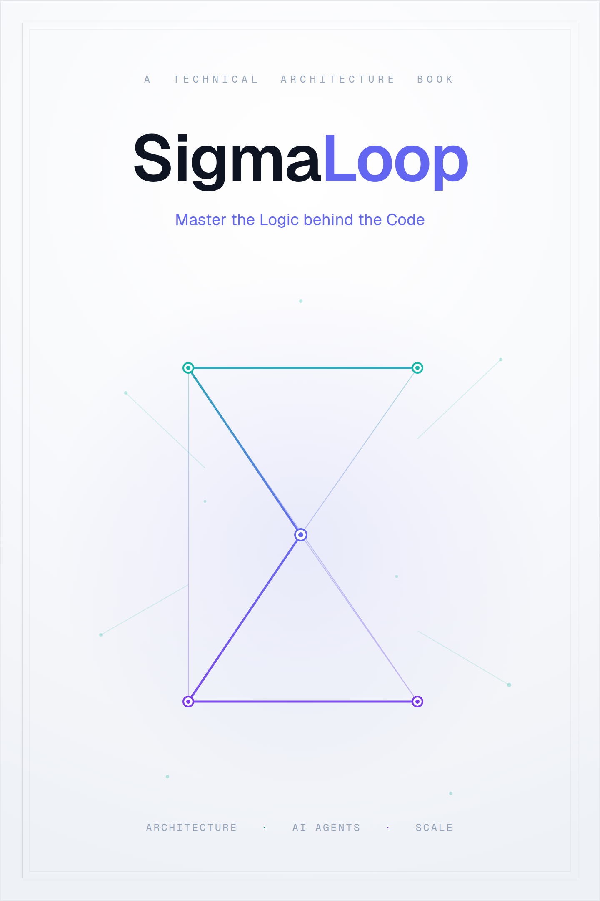

# SigmaLoop

### Master the Logic behind the Code

**A Complete Technical Reference**

*The personalized AI tutor for programming and mathematics —*
*its architecture, its AI pipelines, its grading engines, and how to run it at scale.*

*Figure 0.1 — Cover art: the SigmaLoop title and the tagline "Master the Logic behind the Code" set over a looping sigma (Σ) drawn as a teal-to-indigo node-and-edge graph — a neural network and a learning path at once.*

---

## Abstract

SigmaLoop is a personalized AI tutor. A learner starts by talking to a mentor chatbot
or by answering a short onboarding questionnaire; from that, the system **generates an
entire curriculum just for them** — a course, its lessons, and a mix of programming,
mathematics, and multiple-choice challenges, each with the artefacts needed to grade
it. There is no shared catalogue, no instructor-authored content, and no contests:
every course, lesson, and challenge in the database was produced by the AI generation
pipeline for one specific user.

Three things make the system technically distinctive, and this book gives each its own
deep chapter:

- **A lazy, self-healing generation pipeline** that turns a one-sentence goal into a
  twelve-lesson course while spending only a couple of model calls up front
  (Chapter 12).
- **Three deliberately different grading engines** — a Judge0 code sandbox, a
  confidence-gated LLM math grader, and deterministic server-side MCQ scoring — chosen
  so that machine judgement is confined to exactly the place where it is irreplaceable
  (Chapter 14).
- **A runtime translation pipeline** that localizes both the UI and the AI-generated
  content into 30 languages, with first-class right-to-left support, without a single
  static translation file (Chapter 15).

Around that core sits a conventional but carefully built platform: a TypeScript
Express API over MongoDB, a React 19 single-page app, JWT auth, an autonomous
tool-using mentor agent, an admin "god panel," and a runtime-tunable configuration
system. The final third of the book is about **operations**: running the stack locally
in Docker, deploying it on AWS, autoscaling the judge and the generation pipeline, and
self-hosting a fine-tuned model — closing with a forward-looking design for evolving
the single-prompt generator into a coordinated **society of specialized AI agents**.

---

## How to read this book

- **The whole story, in order:** read straight through. Parts I–III build the
  vocabulary; Part IV is the AI core; Parts V–VI are operations and the future.
- **The one-hour tour:** Chapters 1, 2, 12, and 14.
- **As a reference:** jump to any chapter; each is self-contained and cross-links the
  others with `[[chapter]]`-style references and real `file:line` citations.

Throughout, three kinds of call-out recur:

- **💡 Design Note** — *why* a thing is built the way it is.
- **⚠️ Implementation Note** — where the running code diverges from the ideal or the
  older design docs. These are features of the documentation, not omissions.
- **📸 / 🎨 Figure** — a screenshot to capture or a diagram to generate; see the
  preface in [`../README.md`](../README.md) and the full list in Appendix D.

---

*Version 1.0 · 2026 · Generated against the `main` branch of the SigmaLoop monorepo.*

