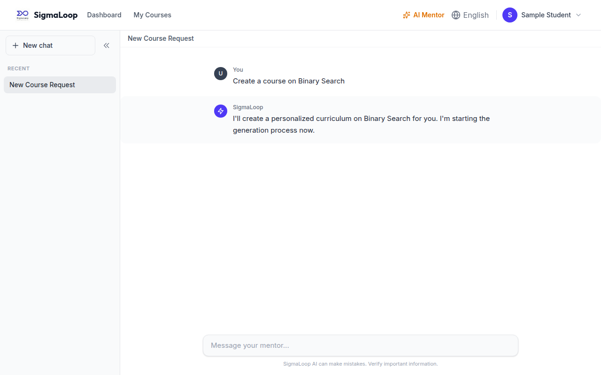

# Chapter 1 — Introduction & Product Vision

## 1.1 What SigmaLoop is

SigmaLoop is a **personalized AI tutor for programming and mathematics**. Its promise
is captured in the tagline *"Master the Logic behind the Code"*: the product is not a
video library or a fixed syllabus, but a system that figures out what a particular
learner needs and then **manufactures the learning material for that need on demand.**

A learner gets started in one of two ways:

1. **Talking to the mentor chatbot** — a conversational, Socratic AI tutor that asks
   what they want to learn, gauges their level, and can act on their behalf.
2. **Answering a guided onboarding questionnaire** — a hybrid flow: the learner first
   picks topics from a static library, and the system then generates AI-tailored
   follow-up questions to refine the goal.

Either path ends the same way: the system deduces what the learner needs and
**generates a personalized curriculum** — a `Course`, its `Lesson`s, and the
`Challenge`s inside them, each complete with the artefacts required to teach and grade
it.

> 💡 **Design Note — the no-catalogue principle.** There are *no* instructor-authored
> courses, *no* public catalogue, and *no* contests. **Every** course, lesson,
> challenge, and test case in the database was produced by the AI generation pipeline
> for one specific user, and is owned by that user. This single decision ripples
> through the entire system: ownership is enforced on every read, there is no
> "browse other people's courses" surface, and content creation has exactly one
> sanctioned path — the generation pipeline (and the mentor tools that drive it).

## 1.2 The unit of learning: a lesson of mixed challenges

The atomic experience is the **lesson**. A lesson holds a markdown teaching body
(optional — a "challenge-only" practice lesson can skip it) and **many challenges of
mixed kinds**. A lesson is *complete* only once **all** of its challenges are passed.

This is deliberately richer than "one problem per page." A single lesson on, say,
recursion might contain a multiple-choice check of understanding, a programming
challenge to implement a recursive function, and a math challenge to prove a
recurrence's complexity — and the learner is not done until all three are green.

## 1.3 The three kinds of challenge

Challenges come in three kinds, and the choice of how to **grade** each is the
intellectual core of the product.

| Kind | What the AI authors | How it is graded |
|------|---------------------|------------------|
| **PROGRAMMING** | A prompt, starter code, a reference solution, and a set of test cases | A **Judge0** sandbox executes the learner's code against the AI-generated test cases. **Deterministic.** |
| **MATH** | A problem (LaTeX), a canonical solution (LaTeX), and a grading rubric | The learner's LaTeX is sent to the active AI provider along with the problem and canonical solution; it returns a **structured verdict**. *LLM judgement.* |
| **MCQ** | A question stem, options (each flagged correct/incorrect with an explanation), and an `allowMultiple` flag | **Deterministic, server-side**: set-equality of the chosen option IDs against the correct set. Option correctness is never sent to the student until they submit. |

> 💡 **Design Note — why three graders, not one.** The split is intentional and is the
> system's defining engineering opinion. Programming and MCQ grading are kept
> **deterministic** (a sandbox and a set comparison), so they are fast, free, and
> never "hallucinate" a wrong grade. LLM judgement is **confined to mathematics** —
> the one place where deterministic grading is genuinely brittle, because
> `x^2 + 2x + 1` and `(x+1)^2` are the same answer in different clothes. Even there,
> the LLM's verdict carries a **confidence** score, and a low-confidence grade is held
> for review rather than trusted (see Chapter 14). The product uses exactly as much AI
> as it must, and not a drop more.

## 1.4 The mentor can act

The mentor is not a passive chatbot. It is **autonomous and tool-using**: it can read
the learner's own courses, lessons, and progress, and it can *create* courses, *generate*
more lessons, and *create or edit* lessons and courses on the learner's behalf — then
report what it did.

Crucially, it does this through a **provider-agnostic `[[ACTION: {…}]]` JSON protocol**
and a server-side loop, **not** native function-calling. That choice exists so that a
mid-conversation failover between AI providers (DeepSeek → Gemini) can never corrupt
the tool transcript — the subject of Chapter 13.

*Figure 1.1 — The mentor in action.*

## 1.5 The shape of the system

At a glance:

- **Backend** — a Node.js + Express + TypeScript REST API over MongoDB (Mongoose),
  speaking the JSend response format at `http://localhost:4000/api/v1`.
- **Frontend** — a React 19 + TypeScript + Vite single-page app at
  `http://localhost:5173`, talking to the API over Axios.
- **AI** — **DeepSeek is the primary model**; **Google Gemini 2.5 Flash is an automatic
  fallback**. Both sit behind a single `AIClient` interface so the provider is
  swappable (and could become Bedrock without touching business logic).
- **Code execution** — a Judge0 CE sandbox (Docker, port 2358) runs the AI-generated
  test cases for programming challenges.
- **Async generation** — a curriculum request enqueues a `CurriculumJob`; a worker
  processes it and writes the `Course` / `Lesson` / `Challenge` documents. The chat is
  never blocked on generation.

The whole architecture is the subject of Chapter 2; the repository layout is Chapter 3.

## 1.6 Two roles, and only two

SigmaLoop has exactly two roles: **STUDENT** and **ADMIN**. There is no INSTRUCTOR
role — any reference to one in older code or design documents is stale. Students own
and consume their generated content; admins get a runtime-settings panel and a generic
"god panel" over every collection for operations and support (Chapter 5, Chapter 7).

## 1.7 A note on the product's history

The repository began life as a more conventional learning-management system (the
`Graduation Project/` folder holds those original academic design documents, and a few
legacy names like the `lambda_lap` database survive in Docker defaults). The product has
since **pivoted** to the personalized-tutor vision described here. Throughout this book,
where the running code still carries an artefact of the old design, it is flagged as an
**⚠️ Implementation Note** so the reader is never misled.

## 1.8 What to read next

- For the architecture and the request lifecycles, continue to **Chapter 2**.
- To orient inside the source tree, **Chapter 3**.
- If you came for the AI, jump to **Chapter 11** (the provider abstraction) and then
  **Chapter 12** (the generation pipeline) — they are the engine room.
