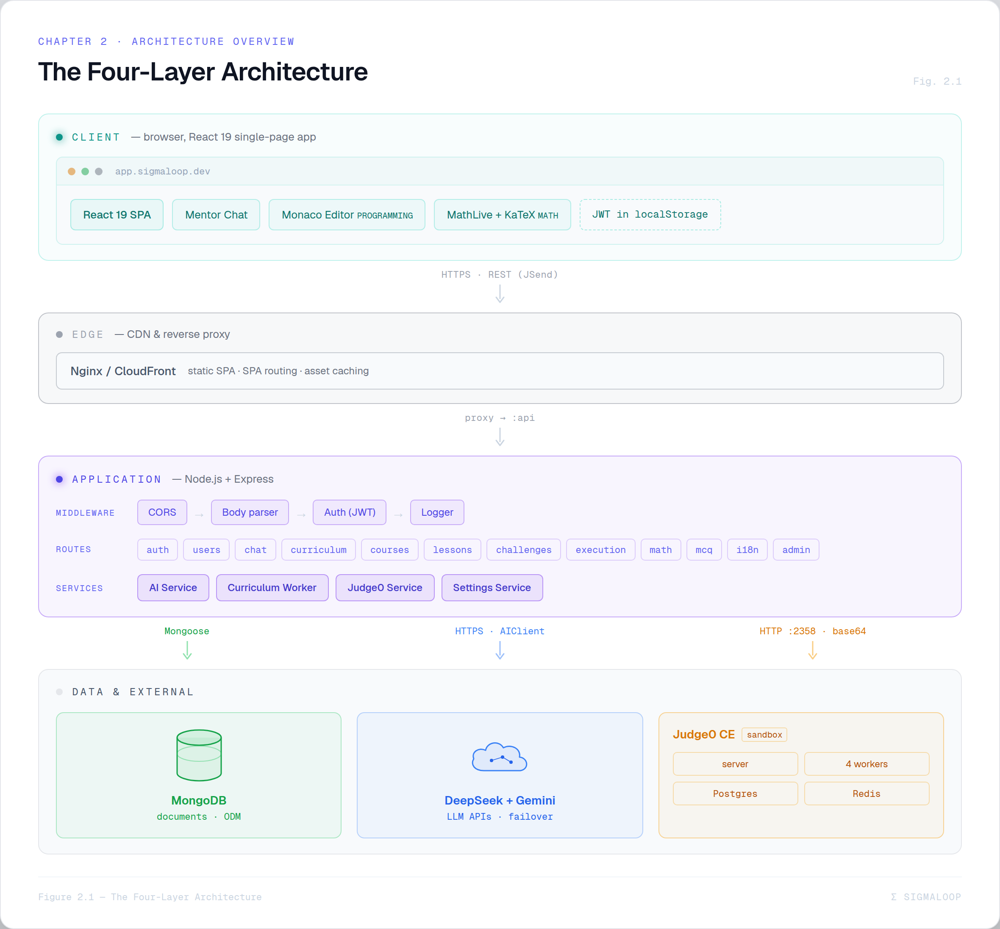
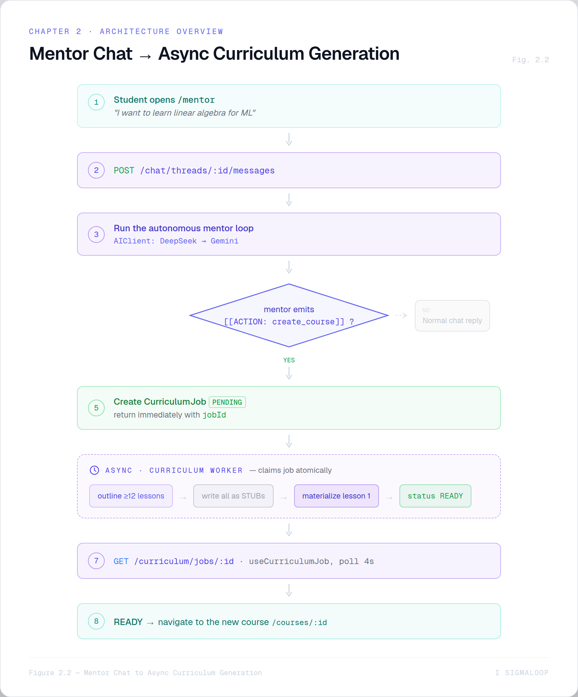

# Chapter 2 — System Architecture Overview

This chapter is the 10,000-foot view: the layers, the request lifecycles, and the
handful of design decisions that shape everything else. Later chapters zoom into each
box; here we draw the whole map.

## 2.1 The four layers

SigmaLoop is a textbook three-tier web application with one extra tier for sandboxed
code execution.


*Figure 2.1 — The four-layer architecture: a Client tier (React 19 SPA · Mentor chat · Monaco · MathLive · JWT) over an Nginx/CloudFront edge, a Node + Express application tier (middleware → route groups → services), and a data & external tier — MongoDB, the DeepSeek + Gemini AI cloud, and the Judge0 CE sandbox — wired by labelled HTTPS/Mongoose/AIClient/base64 arrows.*

The text version (from `architecture-diagram-spec.md`) for quick reference:

```
LAYER 1  CLIENT      React 19 SPA · Mentor chat · Monaco · MathLive/KaTeX · Auth (JWT)
            │  HTTPS / REST (JSend JSON), Authorization: Bearer <JWT>
LAYER 2  EDGE        Nginx (prod): serves SPA, SPA routing, 1-year asset cache
            │  HTTP :80 → :4000
LAYER 3  APP         Node.js + Express (TS), /api/v1/*
            │  middleware: CORS → JSON → Auth → Logger
            │  routes: auth users chat curriculum courses lessons challenges
            │          execution math mcq i18n admin
            │  services: AI · Curriculum Worker · Judge0 · Settings
            ├──────────────┬──────────────────┬───────────────────
LAYER 4  DATA   MongoDB 7    DeepSeek+Gemini      Judge0 CE
                :27017        (HTTPS, external)    :2358 (server+4 workers+PG+Redis)
```

## 2.2 The pieces, named

| Component | Technology | Responsibility |
|-----------|------------|----------------|
| **SPA** | React 19, TypeScript, Vite, Tailwind v4 | The entire UI. Mentor chat is the entry point; challenge workspaces branch on `challenge.kind`. |
| **Edge** | Nginx (local prod) / CloudFront + S3 (AWS) | Serve static assets, SPA-route fallback to `index.html`, cache. |
| **API** | Node.js, Express 5, TypeScript (CommonJS output) | REST API, JSend responses, JWT auth, all business logic. |
| **Database** | MongoDB 7 + Mongoose | Every document; per-user ownership on every read. |
| **AI layer** | DeepSeek (primary) + Gemini 2.5 Flash (fallback) behind `AIClient` | Mentor chat, curriculum generation, math grading, translation. |
| **Code execution** | Judge0 CE (server + 4 workers + Postgres + Redis) | Run AI-generated test cases for programming challenges. |
| **Generation worker** | In-process Node loop (`curriculumWorker.ts`) locally; Step Functions + Lambda in the AWS proposal | Drain the `CurriculumJob` queue and write generated content. |

## 2.3 Three request lifecycles you must understand

Almost everything in SigmaLoop is a variation on one of these three flows.

### 2.3.1 Talking to the mentor and getting a curriculum

This is the headline journey. It is **two phases**: a synchronous chat turn, then an
asynchronous generation job.


*Figure 2.2 — Mentor chat → async curriculum generation: a student message (`POST /chat/threads/:id/messages`) runs the autonomous mentor loop (AIClient: DeepSeek→Gemini); when the mentor emits `[[ACTION: create_course]]` it creates a `CurriculumJob` (PENDING) and returns a `jobId` immediately, while an **async** worker claims the job and runs outline ≥12 lessons → write stubs → materialize lesson 1 → READY — at which point the polling frontend (`useCurriculumJob`, 4s) navigates to the new course.*

In words (the live code path, Chapter 12 & 13 give the detail):

1. The learner posts a message to a chat thread.
   `POST /api/v1/chat/threads/:threadId/messages` →
   `Backend/src/controllers/chat.controller.ts`.
2. The controller runs a **bounded server-side loop** over the `AIClient`. The model
   may answer in prose, or emit a tool action like `create_course`.
3. `create_course` creates a `CurriculumJob` with `status: PENDING` and returns
   **immediately** — the chat is never blocked on generation. The response carries an
   `actions[]` array describing what the mentor did.
4. The **curriculum worker** (`curriculumWorker.ts`) atomically claims the pending job,
   generates a course *outline*, writes every lesson as a cheap **stub**, fully
   materializes only the first lesson, and flips the job to `READY`. The rest of the
   lessons are generated lazily, on first open.
5. The frontend polls `GET /api/v1/curriculum/jobs/:jobId` (the `useCurriculumJob`
   hook, every 4 s) and navigates to the course when it is `READY`.

### 2.3.2 Solving a programming challenge

1. The learner writes code in Monaco and submits:
   `POST /api/v1/execution/submit { challengeId, code, language }`.
2. `execution.controller.ts` loads the owned `PROGRAMMING` challenge and runs **all** of
   its test cases through Judge0 (`POST /submissions?wait=true&base64_encoded=true`),
   one submission per test case, in parallel.
3. A test case passes iff Judge0 returns status id `3` (Accepted). Results are
   aggregated; a `ProgrammingSubmission` is stored; if every case passed, the lesson's
   completion is re-evaluated and XP is awarded.
4. The frontend shows per-test-case pass/fail, runtime, and memory.

### 2.3.3 Solving a math challenge

1. The learner writes LaTeX in the MathLive editor and submits:
   `POST /api/v1/math/submit { challengeId, latex }`.
2. `math.controller.ts` calls `aiClient.gradeMath(problem, canonical, studentLatex)`,
   which returns `{ correct, equivalentForm, rationale, confidence }`.
3. If `confidence < 0.7`, the submission becomes `PENDING_REVIEW` (it counts neither as
   pass nor fail). Otherwise it is `PASSED`/`FAILED`. The rationale is rendered back to
   the learner as markdown + KaTeX.

(MCQ is a fourth, simpler flow: `POST /mcq/submit`, graded by set-equality — Chapter 14.)

## 2.4 The cross-cutting conventions

A few rules hold everywhere and are worth stating once:

- **JSend everywhere.** Every response is `{ success: true, data }` or
  `{ success: false, message, code, details }`. See `Backend/src/utils/jsend.ts`.
- **Ownership returns 404, not 403.** Asking for another user's resource yields a
  *not found*, never a *forbidden* — so the API never leaks the existence of content
  you don't own.
- **Student-safe serialization is centralized.** One function,
  `utils/challengeSerializer.ts`, strips every answer (reference solutions, hidden test
  cases, MCQ correctness, math canonical solutions) from student-facing reads. Answers
  are revealed only by the grading endpoints.
- **The AI provider is never imported directly in a controller.** All model access goes
  through the `AIClient` interface in `services/ai.service.ts`. This is what makes the
  DeepSeek↔Gemini fallback — and a future Bedrock swap — a one-file change.
- **Config is read at call-time.** The live `config` object can be overlaid at runtime
  by the admin settings system, so consumers read `config.x.y` when they need it rather
  than capturing it (Chapter 7).

## 2.5 Local vs production at a glance

The same code runs in two very different shapes. This duality recurs through Part V.

| Concern | Local / Dev | Production (AWS proposal) |
|---------|-------------|----------------------------|
| SPA serving | Vite `:5173` or Nginx container | S3 + CloudFront + WAF |
| API | `node dist/server.js` / `npm run dev` | ECS Fargate behind a public ALB |
| Database | MongoDB 7 container | DocumentDB (Atlas as fallback) |
| Judge0 | docker-compose (privileged, `COUNT=4`) | ECS **on EC2** + Auto Scaling Group |
| Generation worker | **in-process** inside the API | EventBridge → Step Functions → Lambda |
| Math grader | in-process `gradeMath()` | a dedicated `grade-math` Lambda |
| Test cases / content | embedded in Mongo | externalized to S3, keys in the DB |

> 💡 **Design Note — the one thing that can't be serverless.** Judge0 needs
> `privileged: true` and `cgroup: host` to run its `isolate` sandbox. AWS Fargate does
> not support privileged mode. That single Docker-Compose fact is why, in production,
> the judge is the *only* component pinned to EC2 while everything around it goes
> serverless. It is the thread that connects the local stack to both AWS proposals
> (Chapters 17–18).

## 2.6 Where this book goes from here

We have the map. The rest of the book fills it in, roughly bottom-up then forward:

- **Part II** (Ch 4–7): the backend building blocks — data models, the API, auth, and
  the runtime config system.
- **Part III** (Ch 8–10): the frontend — architecture, the challenge workspaces, the
  design system.
- **Part IV** (Ch 11–15): the AI core — the provider abstraction, the generation
  pipeline, the mentor agent, the judging system, and the translation pipeline.
- **Part V** (Ch 16–19): operations — Docker, AWS, scaling, self-hosted models.
- **Part VI** (Ch 20): the future — a multi-agent generation architecture.
