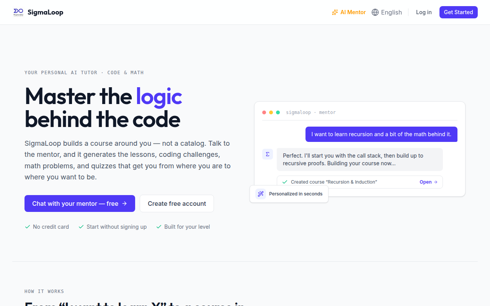
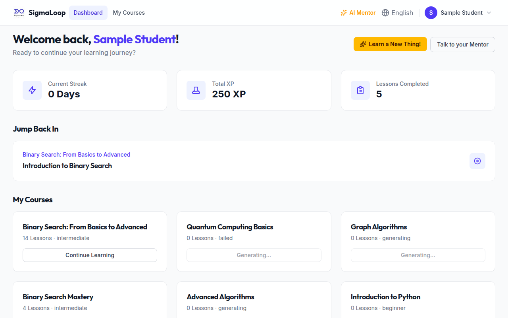
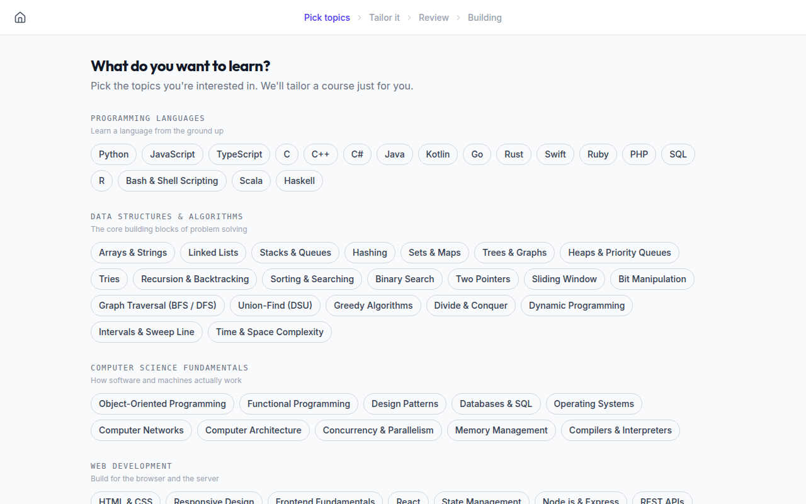
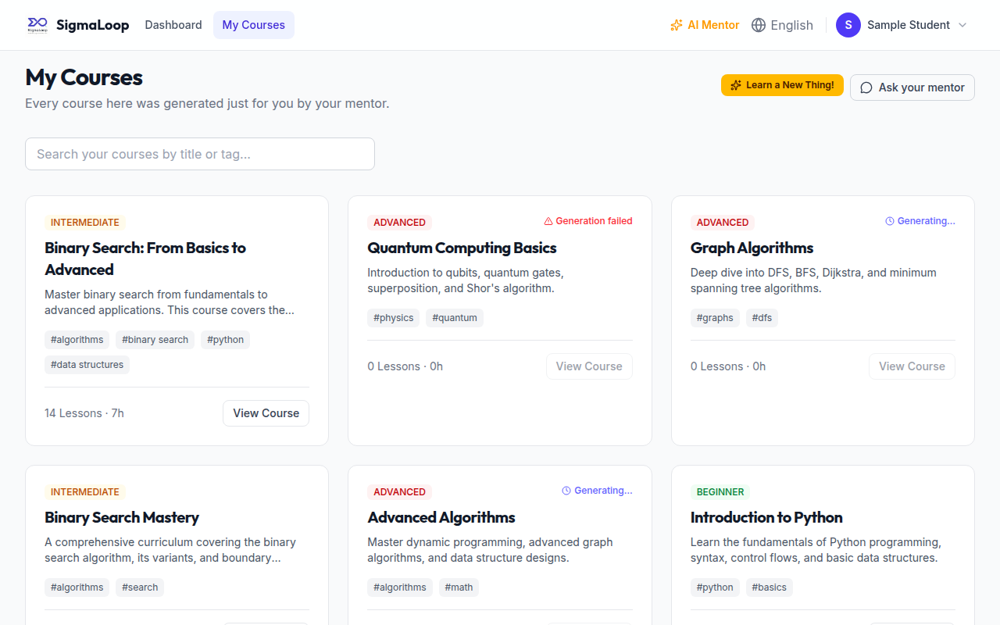
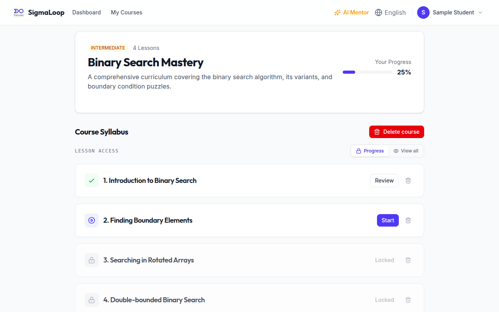
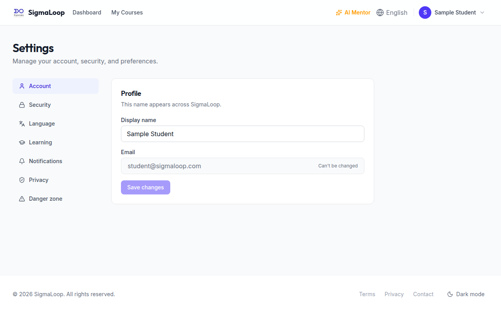
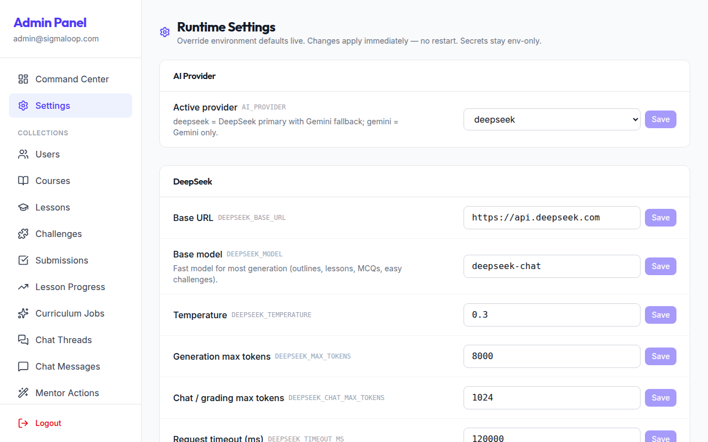

# Chapter 8 — Frontend Architecture

The client is a React 19 + TypeScript + Vite single-page app. This chapter covers its
structure: the provider tree, routing, state management, the services layer, and the
patterns that recur across pages. The challenge workspaces (its most distinctive part)
get their own chapter (9), and the visual language gets Chapter 10.

## 8.1 Stack and build

- **React 19.2**, **TypeScript ~5.9**, **Vite 7**, **Tailwind CSS v4** (CSS-based
  `@theme`, no `tailwind.config.js`), **Vitest** + Testing Library.
- Notable dependencies: `@monaco-editor/react` (the programming editor), `mathlive`
  (the math editor), `react-markdown` + `remark-gfm`/`remark-math`/`rehype-katex`/
  `rehype-highlight` (lesson & chat rendering), `react-resizable-panels` (the lesson
  split panes), `react-router-dom` v7, `axios`, `lucide-react`, `react-helmet-async`.
- **Build** is `tsc -b && vite build`; **serve** in production is an Nginx container
  (`Frontend/Dockerfile`, `nginx.conf`) with SPA fallback and 1-year immutable asset
  caching (Chapter 16).

> ⚠️ **Implementation Note — two legacy artefacts.** The `package.json` is still named
> `lambda-lap-frontend`, and three Admin page files (`AdminDashboard.tsx`,
> `AdminUsers.tsx`, `AdminJobs.tsx`) exist but are **not routed** — superseded by the
> CommandCenter + Explorer. Don't mistake them for the live admin UI.

## 8.2 The provider tree

`main.tsx` mounts `<StrictMode><HelmetProvider><App/></HelmetProvider></StrictMode>`.
`App.tsx` then nests the global providers — order matters:

```
ThemeProvider
└─ Router (BrowserRouter)
   └─ AuthProvider
      └─ LocaleProvider          (reads useAuth + useLocation)
         └─ ConfirmProvider      (mounts the global <ConfirmDialog>)
            └─ Routes
```

`LocaleProvider` sits inside both `AuthProvider` and `Router` because it adopts the
user's saved language once auth loads and re-translates on navigation (Chapter 15).

## 8.3 Routing and guards

Routes are declared inline in `App.tsx`. Two wrapper components gate them:

- **`ProtectedRoute`** — shows a loader while auth resolves, then renders the outlet or
  redirects to `/login`.
- **`PublicRoute`** — the inverse; sends already-authenticated users to `/dashboard`.

The route map (abridged):

| Path | Page | Guard | Layout |
|------|------|-------|--------|
| `/` | Home | Public | MainLayout |
| `/login`, `/register` | Auth | Public | AuthLayout |
| `/mentor` | Mentor | **none** (guests + auth) | MainLayout |
| `/terms`, `/privacy`, `/contact` | Legal | none | — |
| `/dashboard` | Dashboard | Protected | MainLayout |
| `/onboarding` | Onboarding | Protected | full-screen wizard |
| `/my-courses` | MyCourses | Protected | MainLayout |
| `/courses/:courseId` | CourseDetails | Protected | MainLayout |
| `/lessons/:lessonId` | LessonView | Protected | LessonLayout (full viewport) |
| `/settings` | Settings | Protected | MainLayout |
| `/admin`, `/admin/data/:resource[/:id]`, `/admin/overview/:userId`, `/admin/settings` | Admin | Protected + **AdminLayout role guard** | AdminLayout |
| `*` | → `/` | — | — |

> 💡 **Design Note — the admin role guard lives in the layout.** Admin routes are inside
> `ProtectedRoute` (so you must be logged in), but the **ADMIN** check is enforced by
> `AdminLayout`, which redirects non-admins to `/dashboard`. The role gate is one
> component, not repeated per route.

> ⚠️ **Implementation Note — routes vs. the `ROUTES` constants.** `App.tsx` declares
> paths inline rather than via the `constants/routes.ts` helpers; several pages also
> hardcode paths like `` `/courses/${id}` ``. The constants are used by *links* but are
> not the single source of truth for the route table. Harmless, but worth knowing when
> renaming a route.

## 8.4 The services layer

All network access goes through `services/api.ts`, an Axios instance with two
interceptors:

```ts
// request: attach the bearer token
api.interceptors.request.use((config) => {
  const token = localStorage.getItem("token")
  if (token) config.headers.Authorization = `Bearer ${token}`
  return config
})

// response: on 401, clear token + broadcast; flatten JSend errors to Error(message)
api.interceptors.response.use(r => r, (error) => {
  if (error.response?.status === 401) {
    localStorage.removeItem("token")
    window.dispatchEvent(new Event("auth:unauthorized"))
  }
  return Promise.reject(new Error(error.response?.data?.message || "An unexpected error occurred"))
})
```

The `auth:unauthorized` window event is how a 401 anywhere triggers a global logout —
`AuthContext` listens for it. The response interceptor flattens every failure to a plain
`Error(message)`, so pages catch `err.message`.

On top of `api.ts`, one module per API group: `chatService`, `guestChatService`,
`courseService`, `curriculumService`, `questionnaireService`, `lessonService`,
`mathService`, `mcqService`, `userService`, `adminService`, `i18nService`. Each is a thin
typed wrapper around the endpoints from Chapter 5.

> ⚠️ **Implementation Note — the hard-coded base URL.** `api.ts` sets
> `baseURL = "http://localhost:4000/api/v1"` directly, ignoring `VITE_API_BASE_URL` /
> `API_BASE_URL`. The documented env override does not actually reach the live client;
> a production build must edit this line. Also note there is **no** `authService.ts` —
> login/register call `api.post("/auth/...")` inline and session restore lives in
> `AuthContext`.

> ⚠️ **Implementation Note — error `details` are lost.** Because the interceptor reduces
> errors to `Error(message)`, code that reaches for `err.response.data.details` (e.g. in
> `AdminSettings`) finds it `undefined`. Fixable by preserving the original error on the
> rejected object.

## 8.5 State management: contexts and hooks

SigmaLoop deliberately uses **React context + localStorage**, not Redux/Zustand. Four
contexts hold global state:

- **`AuthContext`** — `{ user, token, isAuthenticated, isLoading, login, logout,
  refreshUser }`. On mount with a token it restores the session via `GET /auth/me`;
  `login` writes `localStorage["token"]`; `logout` clears it and dispatches `auth:logout`
  (which `LocaleContext` uses to reset language).
- **`ThemeContext`** — `{ theme, toggleTheme, isDark }`, persisted, toggles the `.dark`
  class on `<html>`. The toggle lives in the Footer.
- **`LocaleContext`** — the on-demand i18n engine: `{ language, direction, isTranslating,
  isPageLoading, setLanguage, t }`. Detailed in Chapter 15.
- **`ConfirmContext`** — a promise-based `useConfirm()` / `useAlert()` replacing native
  `window.confirm` / `alert`; mounts one `<ConfirmDialog>`.

Four custom hooks carry the cross-cutting behaviours:

- **`useCurriculumJob(jobId)`** — *the* job-polling primitive. Polls `getJob` every 4 s
  until `READY`/`FAILED`, returns `{ job, error, isGenerating }`. Passing `null` disables
  it. Used by Onboarding, CourseDetails, and per-row inside the ChatWidget.
- **`useDebounce`**, **`useLocalStorage`** (returns `[value, set, remove]`),
  **`useClickOutside`** (closes dropdowns).

> 💡 **Design Note — two polling strategies, on purpose.** A *single* job (a course being
> generated) is watched with `useCurriculumJob`. A *list* of jobs (MyCourses, which may
> show several generations in flight) instead uses an inline `setInterval(5000)` that
> self-stops when nothing is in flight. One hook can't cleanly watch a dynamic list, so
> the list case is handled directly.

## 8.6 The pages, briefly

Each page is summarized here; the ones worth screenshotting carry a figure callout.

- **Home (`/`)** — the marketing landing page; no API. The hero uses the `[[logic]]`
  translation-highlight marker (Chapter 15) and CTAs into `/mentor` and `/register`.
  
  *Figure 8.1 — Landing page hero.*
- **Login / Register** — controlled forms posting to `/auth/*`, then `login()`, then
  `guestChatService.importIfPending()` (carry a guest transcript into a real thread),
  then navigate to `/mentor?thread=<id>` or `/dashboard`.
- **Dashboard (`/dashboard`)** — `GET /users/dashboard` + the user's courses; stat cards
  (streak / XP / lessons), quick-resume, course grid.
  
  *Figure 8.2 — Returning-user dashboard.*
- **Onboarding (`/onboarding`)** — the four-step wizard (topics → AI questions → review →
  generating). Drives `questionnaireService.getFollowUps` then `submit`, polls the job,
  navigates to the new course (Chapter 12).
  
  *Figure 8.3 — Onboarding wizard.*
- **MyCourses (`/my-courses`)** — courses + in-flight jobs (list-polled), with
  difficulty / "Generating…" / "Generation failed" badges and the amber "Learn a New
  Thing!" button → `/onboarding`.
  
  *Figure 8.4 — My Courses.*
- **CourseDetails (`/courses/:id`)** — course + syllabus; "Generate more lessons" and
  "Generate practice challenges" buttons (poll via `useCurriculumJob`); the
  PROGRESS/VIEW_ALL lock toggle; delete with `useConfirm`.
  
  *Figure 8.5 — Course syllabus.*
- **LessonView (`/lessons/:id`)** — the IDE-like workspace; its own Chapter 9.
- **Settings (`/settings`)** — seven tabs (account / security / language / learning /
  notifications / privacy / danger), all backed by `userService`; optimistic toggles,
  data export, password-confirmed account deletion.
  
  *Figure 8.6 — Settings.*
- **Admin** — `CommandCenter` (metrics dashboard), the generic Explorer
  (`ResourceList`/`ResourceDetail` over 10+ collections with a raw-JSON editor),
  `AdminSettings` (the runtime overlay UI), and `UserOverview` (a per-user 360°).
  
  *Figure 8.7 — Admin Command Center & Settings.*

## 8.7 The chat surface

The mentor UI is reused in three contexts (general, course, lesson) via one component:

- **`ChatWidget`** — the generic chat surface. It manages threads, optimistic user
  messages, and — crucially — renders the mentor's `actions[]`: each action becomes a
  `MentorActionRow`, and a row for an async job hosts its own `useCurriculumJob` poller
  ("Generating… → Open course"). It can pull live editor code via a `getCodeContext()`
  callback so lesson chat sees the learner's attempt (Chapter 13).
- **`GuestChat`** — the tool-less public mentor; transcript in `localStorage`, posts to
  `/chat/guest`, with sign-up CTAs; imports into a real thread on signup.
- **`MessageContent`** — the shared markdown renderer (GFM + math + syntax highlight),
  used by chat, lessons, MCQ, and the math verdict panel.

## 8.8 localStorage: the quiet workhorse

A surprising amount of client state lives in `localStorage`, by design:

- `token` (auth), `theme`, `locale` (language).
- `sigmaloop_guest_chat` — the guest transcript (cap 40 messages).
- Per-challenge drafts: `sigmaloop_code_${challengeId}_${language}`,
  `sigmaloop_math_${challengeId}`, `sigmaloop_mcq_${challengeId}`. The code draft key is
  shared between the programming workspace and the lesson chat's code context — so the
  hint model can see exactly what's in the editor.

This is why a learner can refresh mid-challenge and not lose work, and why the lesson
tutor can reference "your current code" without a round-trip. Chapter 9 opens up those
workspaces.
