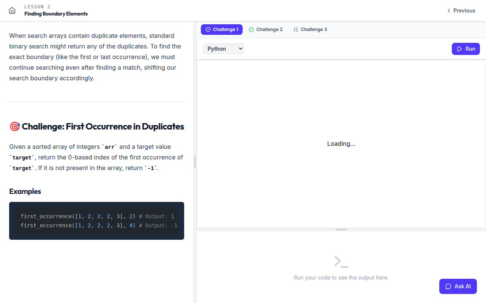

# Chapter 9 — The Challenge Workspaces

If the generation pipeline is the heart of the backend, the challenge workspaces are the
heart of the frontend. This is where the three challenge kinds become three genuinely
different interactive experiences — a code IDE, a math editor, a quiz — all stitched into
one lesson. The code lives under `Frontend/src/pages/Lesson/`.

## 9.1 The dispatcher

Everything branches on `challenge.kind`. `ChallengeWorkspace.tsx` is the switch:

```tsx
if (challenge.kind === CHALLENGE_KINDS.MATH) return <MathWorkspace ... />
if (challenge.kind === CHALLENGE_KINDS.MCQ)  return <MCQWorkspace  ... />
return <ProgrammingWorkspace ... />   // default
```

Each workspace owns its own state, persists a draft to `localStorage`, and calls a
shared `onCompleted()` callback when its challenge is passed — which lets the parent
`LessonView` mark the challenge done and re-evaluate lesson completion.

> 🎨 **FIGURE 9.1 — The kind-dispatched workspace**
> *Diagram — generate with Claude image generation.* **Prompt:**
> "A clean diagram on white, indigo accent. A central rounded box 'ChallengeWorkspace
> (switch on challenge.kind)' with three labelled branches: 'PROGRAMMING →
> ProgrammingWorkspace (Monaco editor + Output panel, POST /execution/submit)', 'MATH →
> MathWorkspace (MathLive math-field + Verdict panel, POST /math/submit)', 'MCQ →
> MCQWorkspace (option buttons, POST /mcq/submit)'. Each branch shows a tiny wireframe of
> its UI. All three converge on a shared callback 'onCompleted() → LessonView marks
> challenge passed'. Flat, hairline borders."

## 9.2 ProgrammingWorkspace — code, run, grade

**Layout.** A vertical, resizable split (`react-resizable-panels`): the `CodeEditor`
(~70%) over the `OutputPanel` (~30%), with a language `<select>` (shown only when the
challenge offers more than one language) and a green **Run** button.

**Editor.** `CodeEditor.tsx` is a thin Monaco wrapper. Theme follows the app theme
(`vs-dark` / `light`), minimap off, `automaticLayout` on, 14px font.

**Drafts.** Code is keyed `sigmaloop_code_${challengeId}_${language}` in `localStorage` —
the same key the lesson chat reads for code context (Chapter 8, Chapter 13).

**Submit.** Despite the "Run" label, the button is a real submission:
`lessonService.submitCode({ challengeId, code, language })` → `POST /execution/submit`.
On success the `OutputPanel` shows a per-test-case breakdown; on `lessonCompleted` it
shows a "+50 XP" banner; on `status === "PASSED"` it calls `onCompleted()`.

**Output.** `OutputPanel.tsx` has three states — loading, empty ("Run your code…"), and
results. Results show a pass/fail header (`passed/total`, runtime, memory) and a
collapsible card per test case (auto-expanded when failed) with Input / Expected / Your
Output / stderr. Network or compile failures render through a synthetic `ERROR` result.


*Figure 9.2 — Programming workspace.*

## 9.3 MathWorkspace — LaTeX without typing LaTeX

**Layout.** A vertical split: the `MathEditor` (~55%) over the `MathOutputPanel` (~45%),
with a green **Run** button (disabled when blank).

**Editor.** `MathEditor.tsx` wraps a **MathLive `<math-field>`** — a WYSIWYG math editor
that emits LaTeX. It:

- points MathLive's fonts at `/mathlive/fonts` (served from `public/`),
- wires the field's `input` event to emit LaTeX,
- intercepts **Enter** to insert a `\\` line break (and stops MathLive's own handler to
  avoid a double break),
- offers a **Math Keyboard** toggle (the on-screen virtual keyboard) and a **Show/Hide
  LaTeX** toggle that reveals exactly the LaTeX source that will be submitted,
- draws a custom placeholder overlay (MathLive would otherwise typeset the placeholder as
  math).

**Drafts.** LaTeX keyed `sigmaloop_math_${challengeId}`.

**Submit.** `mathService.submit({ challengeId, latex })` → `POST /math/submit`.
`onCompleted()` fires only on `status === "PASSED"`.

**Verdict.** `MathOutputPanel.tsx` renders one of three states from a `statusConfig` map:
**PASSED** (green "Correct"), **FAILED** (red "Incorrect"), and **PENDING_REVIEW** (amber
"Pending review" — for `confidence < 0.7`, with an explainer that it counts neither way).
It shows a blue "Equivalent form" chip when `verdict.equivalentForm` is set, and renders
the LLM's `rationale` as markdown + KaTeX.


*Figure 9.3 — Math workspace.*

## 9.4 MCQWorkspace — the reveal pattern

**Layout.** No split panel — a single scroll column: the markdown+KaTeX prompt, the
option buttons, then a verdict summary.

**Selection.** Single-answer renders radio-style (`rounded-full`); `allowMultiple`
renders checkbox-style (`rounded-md`) with toggling. Selection persists to
`sigmaloop_mcq_${challengeId}`.

**Submit.** `mcqService.submit({ challengeId, selectedOptionIds })` → `POST /mcq/submit`.
`onCompleted()` fires on `verdict.correct`. A **Try again** button resets the selection.

**The reveal.** This is the important pattern: the challenge payload arrives with **no**
correctness data — options are just `{ id, text }`. Correctness arrives **only** in the
submit response (`correctOptionIds`, per-option `explanations`, `rationale`). Before
submit, selected options highlight indigo. After submit, they recolor: green (correct),
red (selected-but-wrong), dimmed (unselected), each with its explanation, plus a summary
banner reading Correct / Partially correct / Incorrect.


*Figure 9.4 — MCQ workspace, post-submit.*

## 9.5 ChallengeTabs — many challenges, one lesson

When a lesson has more than one challenge, `LessonView` renders `ChallengeTabs.tsx`
above the workspace: a horizontal strip with one tab per challenge, each showing a
kind icon (Code / Calculator / ListChecks) or a green check once completed, labelled
"Challenge {n}". Selecting a tab swaps the active workspace. The lesson is complete only
when every tab is green.


*Figure 9.5 — Multi-challenge lesson.*

## 9.6 LessonView — the orchestrator

`LessonView.tsx` (the richest page in the app) ties it all together:

- **Lazy materialization.** If `getLesson` returns `status: "STUB"`, it calls
  `generateLesson` and then polls (`pollUntilReady`, 40 × 3 s) while the backend builds
  the body and challenges, showing a "Generating this lesson…" state. A ref guards
  against React StrictMode double-effects. This is the client half of the lazy pipeline
  from Chapter 12.
- **Completion tracking.** A `completed: Set<challengeId>` is seeded from each
  challenge's `passed` flag; `lessonComplete = challenges.every(c => completed.has(c.id))`.
- **Lesson locking.** `lockMode = user.preferences.learning.lessonLockMode`. In
  `PROGRESS` mode, "next" requires `lessonComplete`; in `VIEW_ALL` it's always open.
- **Layout.** Desktop is a horizontal resizable split (Lesson content | Challenge
  workspace | optional Chat), with a floating "Ask AI" button; mobile is a three-tab bar
  (Lesson / Challenge / AI Chat).
- **On-demand translation.** A Translate button calls `lessonService.translateLesson`;
  a `view` memo swaps translated prose over the original while preserving code, LaTeX,
  option ids, and the `passed` flags (Chapter 15).
- **Code context for chat.** `getCodeContext()` reads the active programming challenge's
  draft from `localStorage` and hands it to the embedded `ChatWidget`, so the lesson
  hint model sees the learner's actual code.

> 💡 **Design Note — the workspace as the product's "feel."** The decision to render
> three fundamentally different editors — a real Monaco IDE, a real WYSIWYG math editor,
> a real quiz — rather than a single textarea, is what makes SigmaLoop feel like a tutor
> and not a form. The cost is three code paths to maintain; the payoff is that each kind
> of problem is authored, attempted, and graded in its native medium.

The frontend's last chapter, 10, covers the visual language that holds all of this
together.
