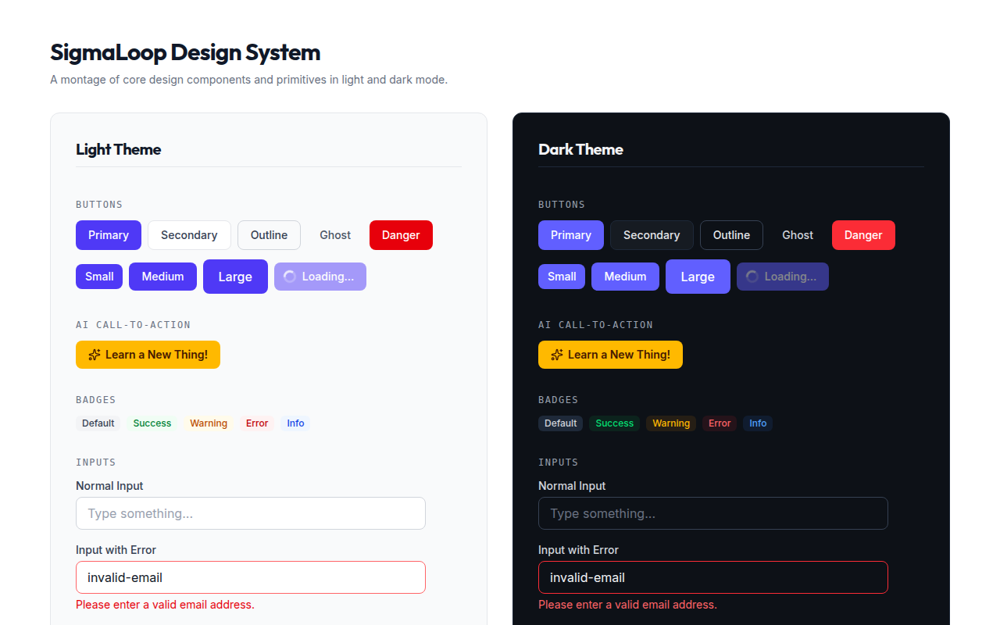

# Chapter 10 — The Design System

SigmaLoop's UI follows a deliberate, documented visual language: **clean and technical**,
in the lineage of Linear and Vercel. This chapter records it so new screens stay
consistent. The authority is `Frontend/DESIGN_SYSTEM.md` plus `Frontend/src/index.css`.

## 10.1 The aesthetic, in one sentence

Flat, hairline-bordered surfaces; one restrained indigo accent; **no** gradients, glass,
or glow. The product was redesigned (June 2026) *away* from an earlier glassmorphism
look toward this flat, technical language.

> 💡 **Design Note — the names lie, the look doesn't.** For backward compatibility the
> old CSS utility names were kept while their *implementations* were flattened. So
> `.glass-panel` and `.glass-card` are now plain bordered surfaces with no blur or
> frost; `.text-gradient` is now a **solid** indigo, not a gradient. If you read the
> class names expecting glass, you'll be surprised — read `index.css`, not the name.

## 10.2 Tailwind v4, configured in CSS

There is no `tailwind.config.js`. Configuration lives in `index.css` via `@theme`:

- `@import "tailwindcss"` + `@plugin "@tailwindcss/typography"`.
- `@custom-variant dark` keyed on a `.dark` class on `<html>` (toggled by
  `ThemeContext`).
- Fonts: `--font-sans: Inter`, `--font-display: Outfit` (headings get
  `font-display tracking-tight`), `--font-mono` a system stack.
- Scrollbars are hidden site-wide (scrolling still works).
- An **RTL safeguard**: under `[dir="rtl"]`, code/math elements (`pre`, `code`,
  `.katex`, `math-field`, `.monaco-editor`) are pinned back to `direction: ltr` so code
  and equations never mirror (Chapter 15).

## 10.3 The custom utilities

| Utility | What it renders now (flat) |
|---------|----------------------------|
| `.glass-panel` | `bg-white` + `border border-gray-200` + `shadow-sm` (dark: `#161b22`, no shadow) |
| `.glass-card` | flat `bg-white` + hairline border that firms on hover; no shadow lift |
| `.text-gradient` | **solid** `text-indigo-600` (dark `indigo-400`) |
| `.icon-tile` | flat `bg-indigo-50 text-indigo-600` accent tile |
| `.eyebrow` | `font-mono text-xs uppercase tracking-[0.12em]` kicker label |

Plus MathLive theming (indigo caret/selection), on-screen keyboard viewport caps, and a
`.loading-bar` keyframe used by the translation progress bar.

## 10.4 Principles and the radius scale

From `DESIGN_SYSTEM.md`:

- **Flat surfaces, hairline borders.** No drop shadows for elevation; depth comes from
  borders, not blur. `backdrop-blur` survives only on the fixed navbar.
- **One accent.** A single restrained indigo (`#6366f1` family). No gradient text, no
  gradient buttons, no glow.
- **A consistent radius scale:** cards / panels / modals `rounded-xl`; buttons / inputs
  `rounded-lg`; badges / tags / chips `rounded-md`; avatars / dots / progress
  `rounded-full`.

> ⚠️ **Implementation Note — stale tables in `DESIGN_SYSTEM.md`.** Parts of that doc's
> token tables still describe the *old* glassmorphism values (`bg-white/70
> backdrop-blur-md`). The prose at the top and the actual `index.css` are the flat
> versions and supersede those tables. When in doubt, trust `index.css`.

## 10.5 Component primitives

`components/ui/` holds the building blocks:

- **`Button`** — five variants (primary / secondary / ghost / danger / outline), three
  sizes, an `isLoading` spinner, `rounded-lg`.
- **`Card`** — a flat `.glass-card` with optional title/footer.
- **`Badge`** — default / success / warning / error / info, `rounded-md`.
- **`Input`** — labeled, with an error state.
- **`ConfirmDialog`** — a portaled modal driving `ConfirmContext`.
- **`LearnNewThingButton`** — the distinctive **amber** "Learn a New Thing!" CTA into
  `/onboarding`. It deliberately is *not* built on `Button`, so it can keep its gold
  treatment (matching the amber Mentor link in the navbar) without polluting the button
  variants.

`components/common/` holds the shell: `Navbar` (auth-aware; always-visible amber Mentor
link; profile dropdown; the `LanguageSwitcher`), `Footer` (legal links + the **theme
toggle**), `ErrorBoundary`, the skeleton family (`LoadingSkeleton`, `PageSkeleton`,
`TranslationLoadingScreen`), `EmptyState`, `NotFound`, and `PageMeta` (react-helmet
`<head>` tags).

`components/layouts/` holds the four frames: `MainLayout` (navbar + centered main +
footer), `AuthLayout` (logo + card), `LessonLayout` (`h-screen overflow-hidden`, navbar
only — the IDE owns the viewport), and `AdminLayout` (sidebar + scrolling main, and the
ADMIN role guard).

*Figure 10.1 — The component library.*

## 10.6 Why a design system matters here

A tutoring product lives or dies on whether a learner trusts it enough to keep going.
The flat, technical language signals competence and reduces visual noise so attention
goes to the *content* — the code, the math, the explanation. The discipline of one
accent, one radius scale, and one set of primitives also keeps the (large) surface area
of pages and workspaces visually coherent without a heavyweight component framework.

This closes Part III. We now descend into the engine room: Part IV, the AI core.
