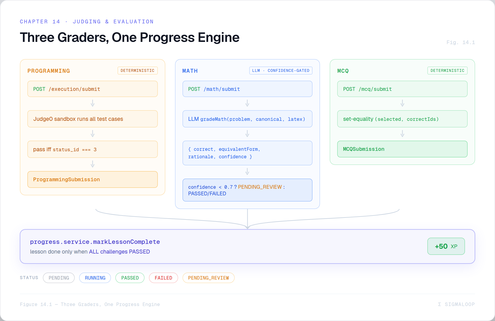
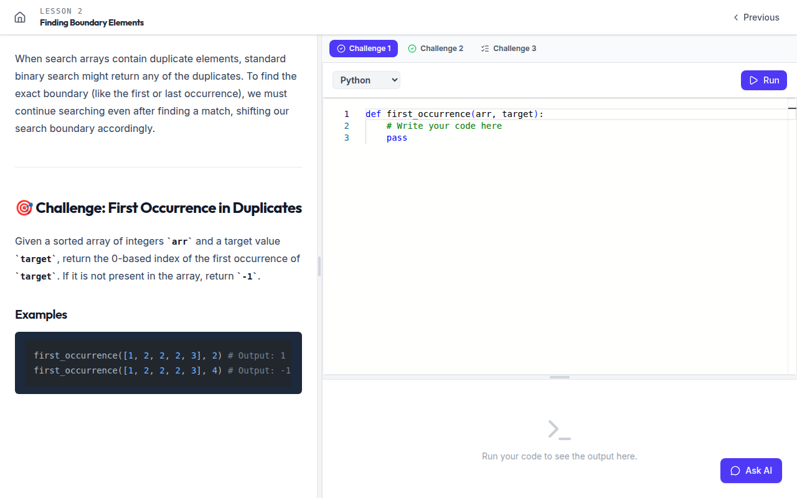

# Chapter 14 — The Judging & Evaluation System ★

> *A focus chapter. How SigmaLoop decides whether an answer is right — three different
> ways, on purpose.*

The grading split is the system's defining engineering opinion: keep machine judgement
out of grading except where it is genuinely irreplaceable. Programming is graded by a
**deterministic sandbox**, MCQ by a **deterministic set comparison**, and only
mathematics by an **LLM** — and even there, behind a confidence gate. This chapter covers
all three graders, the serialization that keeps answers secret until grading, and the
progress engine they all feed.


*Figure 14.1 — Three graders, one progress engine: PROGRAMMING (`POST /execution/submit` → Judge0 runs all test cases, pass iff status id 3) and MCQ (`POST /mcq/submit` → set-equality) are **deterministic**; MATH (`POST /math/submit` → `gradeMath` → `{correct, equivalentForm, rationale, confidence}`, `confidence<0.7` ⇒ PENDING_REVIEW) is the one **LLM, confidence-gated** lane. All three feed `progress.service`, which completes a lesson only when every challenge is PASSED (+50 XP).*

A shared `Status` enum spans all three: `PENDING | RUNNING | PASSED | FAILED |
PENDING_REVIEW`. Only the math path ever produces `PENDING_REVIEW`.

## 14.1 Programming — the Judge0 sandbox

### Run vs submit

There are two endpoints (`execution.controller.ts`):

- **`POST /execution/run`** — iteration in the editor. Runs **only the public** test cases
  (`testCases.filter(tc => !tc.isHidden)`), returns results + metrics, **persists nothing**,
  touches no progress.
- **`POST /execution/submit`** — the graded attempt. Runs **all** test cases (public and
  hidden), persists a `ProgrammingSubmission`, records a streak, and — if every case passed
  — re-evaluates lesson completion.

Both validate that the language is one the challenge offers and is supported.

### Language mapping

`utils/judge0-mapper.ts` maps the seven supported languages to Judge0 CE language ids:

| Language | id | Language | id |
|----------|----|----------|----|
| python | 71 | typescript | 74 |
| cpp | 54 | go | 60 |
| java | 62 | rust | 73 |
| javascript | 63 | | |

### The submission cycle

`judge0.service.ts` submits **one Judge0 submission per test case, in parallel**:

```ts
const response = await axios.post(`${url}/submissions?wait=true&base64_encoded=true`, {
  source_code:     b64(sourceCode),
  language_id:     languageId,
  expected_output: b64(testCase.expectedOutput),
  stdin:           b64(testCase.input)
})
return ensureFinished(url, response.data)
```

Two non-obvious but critical details:

> 💡 **Design Note — base64 everywhere.** Plain-text mode returns HTTP 400 ("cannot be
> converted to UTF-8") whenever the source, stdin, expected output, *or the program's own
> stdout* contains a non-UTF-8 byte. Every field is base64-encoded going in and decoded
> coming out, making all of them binary-safe. This is invisible to the learner but is the
> difference between "works" and "random 400s on certain inputs."

> 💡 **Design Note — `wait=true` is unreliable under load, so we poll anyway.** `wait=true`
> is *supposed* to hold the connection until the run finishes, but under concurrent load
> (especially cold C++ compiles) Judge0 sometimes returns a still-queued submission with
> no terminal status and empty stdout — which surfaced as "Unknown" status with empty
> output. `ensureFinished` detects an unfinished result and polls
> `GET /submissions/{token}` (up to 20 attempts, 150 ms then 500 ms) until `status.id >= 3`.
> A passing test is *strictly* `status.id === 3` (Accepted) — the platform delegates the
> stdout comparison to Judge0 rather than re-diffing.

Per-result, the service decodes stdout/stderr/compile_output, strips a trailing newline
from stdout, tracks max time and memory, and aggregates `{ results, passedCount, total,
allPassed, maxTime, maxMemory }`. The controller turns that into a per-test-case
`testResults` array (index, passed, status, input, expected, actual, stderr, time, memory)
and a `metrics` summary. On submit, a `ProgrammingSubmission` is stored with a
human-readable `outputLog`, and `markLessonComplete` runs if `allPassed`.


*Figure 14.2 — A graded programming submission.*

## 14.2 Mathematics — the LLM grader

Math is the one place the platform trusts an LLM to grade, because `x^2 + 2x + 1` and
`(x+1)^2` are the same answer and no string comparison will ever know that.

### The verdict

`gradeMath(input)` returns:

```ts
interface MathGradeVerdict {
  correct: boolean
  equivalentForm: boolean   // correct, but a different valid form than the canonical
  rationale: string         // educational explanation, may use LaTeX
  confidence: number        // 0..1
}
```

### The prompt

The grader's system prompt (verbatim, abridged) makes the equivalence criteria explicit
*and* tells the model about the confidence threshold:

```
You are the mathematics grader for SigmaLoop...
## Grading criteria
- Two expressions are equivalent if they simplify to the same result
  (e.g., x^2 + 2x + 1 and (x+1)^2).
- Minor formatting differences (spacing, parenthesis style) do NOT affect correctness.
- Focus on mathematical substance, not LaTeX formatting quality.
- Apply the grading rubric when provided.
## Response format
Return ONLY a valid JSON object: { correct, equivalentForm, rationale, confidence }
... Use confidence below 0.7 when the answer is ambiguous, partially correct, or you
cannot reliably judge equivalence.
```

The user prompt supplies the problem LaTeX, the canonical solution LaTeX, the rubric, and
the student's LaTeX. Grading runs on the **fast base model** (it never routes to the
reasoner — Chapter 11) with a small token budget, and the verdict is normalized
defensively: a non-numeric or out-of-range `confidence` collapses to `0`.

### The confidence gate

```ts
function verdictToStatus(verdict): Status {
  if (verdict.confidence < MATH_CONFIDENCE_THRESHOLD /* 0.7 */) return Status.PENDING_REVIEW
  return verdict.correct ? Status.PASSED : Status.FAILED
}
```

> 💡 **Design Note — low confidence is held, never auto-graded.** A verdict below `0.7`
> becomes `PENDING_REVIEW`: it counts as neither pass nor fail, and it does **not**
> complete the lesson. The threshold is enforced server-side **and** communicated to the
> model in the prompt, and the defensive normalization means a garbled confidence also
> lands in review. The principle: when the only grader that can hallucinate isn't sure,
> don't let it decide. The UI shows an amber "Pending review" panel explaining it counts
> neither way. (Per `CLAUDE.md`, the 0.7 threshold is calibrated against a 200-pair
> labeled set.)

### Run vs submit, and the run limit

Because each math grade costs a model call, practice is metered:

- **`POST /math/run`** — a trial grade, **persisted** (`isFinal: false`), capped by
  `mathRunLimit` (default 10). Exhausting it returns `429 MATH_RUN_LIMIT_EXHAUSTED` (a
  final submit is still allowed). Never completes a lesson.
- **`POST /math/submit`** — the final grade (`isFinal: true`), **not** subject to the run
  limit; completes the lesson on `PASSED`.
- **`GET /math/status/:challengeId`** — `{ limit, used, remaining }`.


*Figure 14.3 — A math verdict.*

## 14.3 MCQ — deterministic set-equality

MCQ grading is the simplest and most certain. The core is set-equality of the chosen
option ids against the correct set:

```ts
function setEqual(a, b) {
  if (a.length !== b.length) return false
  const setB = new Set(b)
  return a.every(x => setB.has(x))
}
```

The flow (`mcq.controller.ts`): load the owned MCQ; de-duplicate and stringify the
submitted ids; reject any id that isn't a real option (`400`), an empty selection (`400`),
or more than one selection on a single-answer question (`400`). Then compute
`correctOptionIds` from the (server-only) `isCorrect` flags and grade:

```ts
const correct = setEqual(selected, correctOptionIds)
const partial = challenge.allowMultiple && !correct
             && selected.length > 0 && selected.every(id => correctOptionIds.includes(id))
const status  = correct ? Status.PASSED : Status.FAILED   // MCQ is never PENDING_REVIEW
```

`partial` (you picked only correct options but missed some) is reported for feedback but
does **not** flip the status — partial credit is informational; the lesson stays
incomplete until the set is exactly right.

> 💡 **Design Note — the answer is revealed only on submit.** The challenge payload a
> student reads has options as `{ id, text }` only — no correctness, no explanations
> (Chapter 6). The `POST /mcq/submit` **response** is the single place `correctOptionIds`,
> per-option `explanations`, and the rationale are exposed. So a student cannot inspect
> network traffic to find the answer before answering; the reveal is bound to the act of
> submitting.

## 14.4 The serialization chokepoint (recap)

All three graders depend on `utils/challengeSerializer.ts` keeping the answer out of the
student's hands until grading: programming reference solutions and hidden tests, math
canonical solutions and rubrics, and MCQ correctness/explanations are all stripped from
student reads and surfaced only by the grading endpoints (or to admins). It's covered in
full in Chapter 6; the point here is that **grading and secrecy are two halves of one
design** — the answer exists server-side to grade against, and the serializer is the wall
that keeps it there.

## 14.5 Progress — "all challenges, or it doesn't count"

Every grader, on a pass, calls `progress.service.markLessonComplete`. The rule:

```ts
const challengeIds = await Challenge.distinct('_id', { lessonId })
if (challengeIds.length > 0) {
  const passed = await Submission.distinct('challengeId',
    { userId, challengeId: { $in: challengeIds }, status: Status.PASSED })
  if (passed.length < challengeIds.length) return false   // not all passed → not complete
}
await LessonProgress.findOneAndUpdate({ userId, lessonId },
  { isCompleted: true, completedAt: new Date() }, { upsert: true })
await User.findByIdAndUpdate(userId, { $inc: { 'stats.lessonsCompleted': 1, 'stats.totalXp': 50 } })
```

Properties worth noting:

- **Kind-agnostic completion.** It compares *distinct passed challenge ids* against
  *distinct challenge ids in the lesson*. A lesson of mixed kinds (programming + math +
  MCQ) completes only when **all** are `PASSED` — the comparison doesn't care which grader
  produced each pass.
- **Idempotent and sticky.** An already-complete lesson returns `false` immediately (no
  double XP), and completion is never revoked — a later failed attempt doesn't claw back
  the 50 XP.
- **Content-only lessons** (zero challenges) complete on trigger.

### Streaks

`recordActivity` runs on **every** graded attempt (run or submit, pass or fail), measured
in whole UTC days: first activity → streak 1; same day → unchanged; consecutive day →
+1; a missed day → reset to 1. It's wrapped in a try/catch that swallows errors so a
streak hiccup never fails the underlying submission. A separate `effectiveStreak` is the
*display* value — it returns the stored streak only if the last activity was today or
yesterday, so a stale counter never reads as an active streak.

## 14.6 Why three graders is the right call

| | PROGRAMMING | MCQ | MATH |
|--|-------------|-----|------|
| Grader | Judge0 sandbox | server set-equality | LLM + confidence gate |
| Determinism | full | full | gated |
| Cost per grade | sandbox CPU | ~0 | one model call |
| Can it be wrong? | only if test cases are wrong | no | yes → held for review |

The split spends determinism where it's cheap and reliable, and spends (gated, audited)
LLM judgement only where determinism genuinely fails. It is the clearest example in the
whole system of the guiding principle from Chapter 1: *use exactly as much AI as you must,
and not a drop more.*

Chapter 15 covers the last AI subsystem — translating both the UI and the generated
content into 30 languages.
