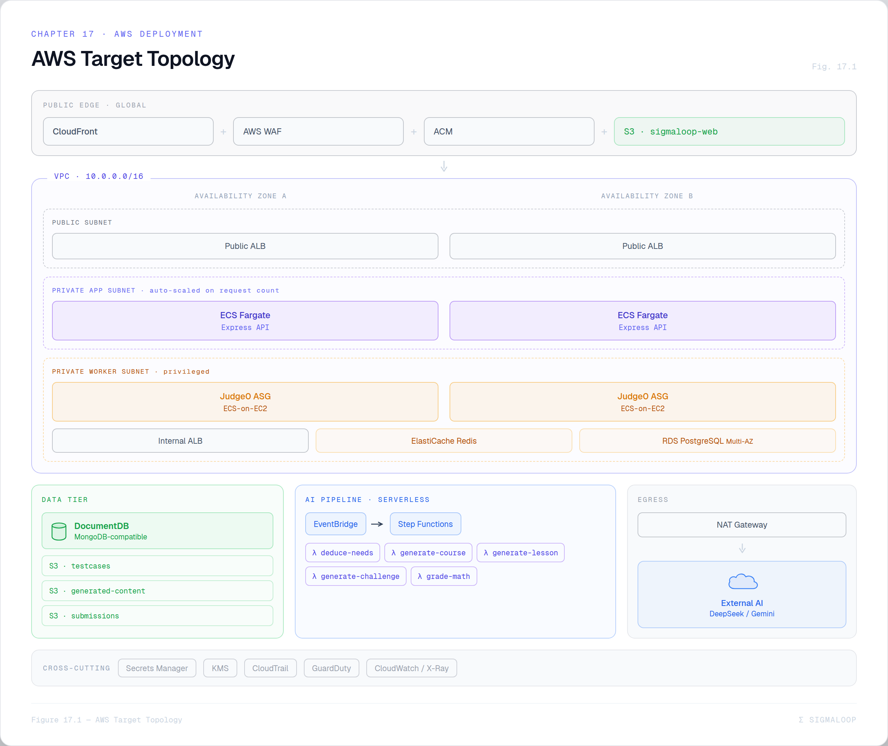
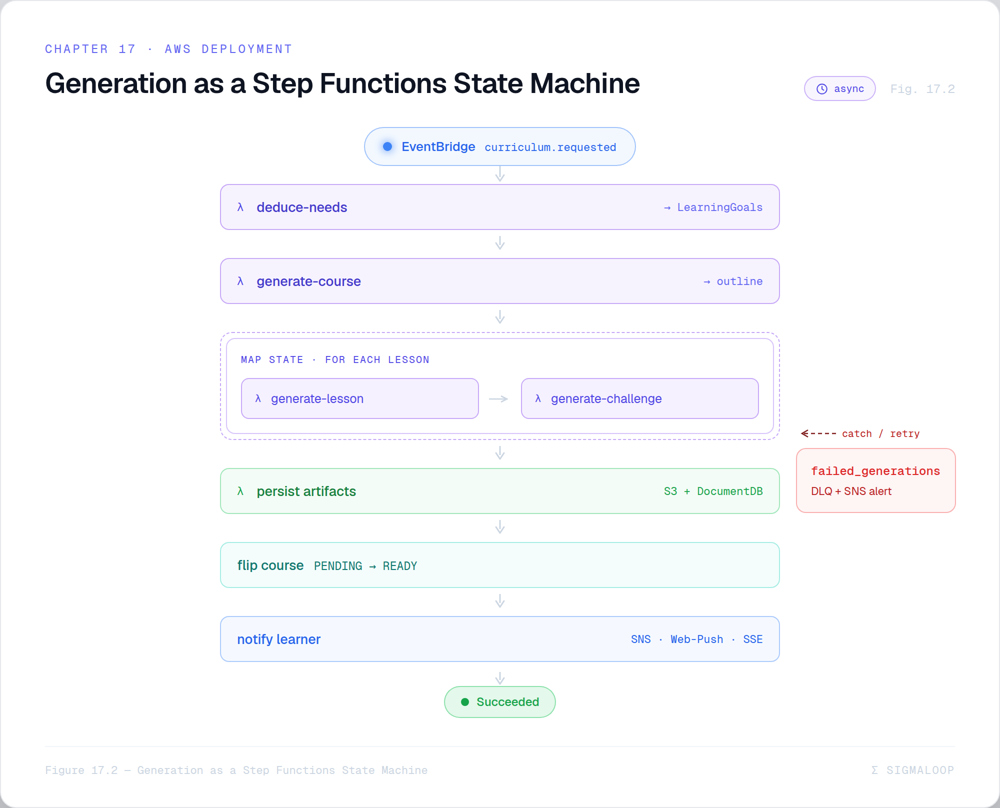

# Chapter 17 — AWS Deployment Architecture ★

> *A focus chapter. How the whole platform is proposed to run on AWS — component by
> component, with the one decision that shapes everything else.*

The deployment plan lives in `Hosting SigmaLoop/README.md` — a Solutions-Architect-style
proposal in twelve sections with embedded Mermaid diagrams. This chapter distills it. A
caveat up front: the proposal is **prose, not infrastructure-as-code**. There is no
bespoke Terraform or CloudFormation in the repo (the one `.template` file in
`Hosting Judge/` is a stock, unrelated AWS sample — §17.8). Everything below is the
*intended* target, and the migration is phased so it can be built incrementally.

## 17.1 The keystone: get content out of MongoDB and into S3

The proposal's first move, before any other AWS service, is to **move test cases and
AI-generated content out of MongoDB into S3**, leaving only metadata and S3 keys in the
database.

> 💡 **Design Note — why the keystone comes first.** Test cases and generated lesson
> bodies are large, write-once, read-often blobs. Keeping them in the document database
> bloats it, couples generation to the DB's write path, and makes the generation pipeline
> hard to separate. Externalizing them to S3 (versioned, KMS-encrypted) de-risks
> *everything downstream*: the database shrinks to metadata, the generation pipeline can
> become its own component, and the migration's first phase needs only a single S3 bucket
> — no compute, no network changes. It is the lowest-risk, highest-leverage first step.

## 17.2 The target architecture, layer by layer

*Figure 17.1 — AWS target topology: a VPC across two AZs — public edge (CloudFront + S3 `sigmaloop-web` + WAF + ACM), a public ALB, a private app subnet (ECS Fargate API, auto-scaled on request count), and a private worker subnet (ECS-on-EC2 Judge0 + internal ALB + ElastiCache Redis + RDS PostgreSQL) — plus DocumentDB, three S3 buckets, the EventBridge → Step Functions → Lambda generation pipeline, NAT egress to the AI provider, and the Secrets Manager/KMS/CloudTrail/GuardDuty cross-cutting layer.*

| Layer | AWS service | Key decisions |
|-------|-------------|---------------|
| **SPA delivery** | S3 (`sigmaloop-web`) + CloudFront + WAF + ACM | A **CloudFront Function** rewrites `404 → /index.html` (the SPA fallback, replacing Nginx). Vite content-hashing means only `index.html` is invalidated per deploy. |
| **API compute** | **ECS Fargate** behind a public ALB | Runs the Backend Dockerfile unchanged. Auto-scales on `ALBRequestCountPerTarget`. |
| **Judge0 compute** | **ECS on EC2** + Auto Scaling Group, internal ALB | The headline decision (§17.3). Baseline 2× t3.medium, ceiling 6. |
| **Judge0 queue** | ElastiCache for Redis (Multi-AZ) | Judge0's *internal* Resque queue — **not** an app-level queue. |
| **App database** | Amazon DocumentDB (replica set) | Mongoose code unchanged; MongoDB Atlas as a defined fallback. |
| **Object storage** | S3 — three buckets, versioned + KMS | testcases, generated-content, submissions. DB stores only keys. |
| **Judge0 database** | RDS PostgreSQL (Multi-AZ) | Required by Judge0; not used by app code. |
| **AI** | external provider over HTTPS via NAT | Key in Secrets Manager; Bedrock as the documented exit path. |
| **Networking** | one VPC, 3 subnet tiers × 2 AZ | public (ALBs only) / private app / private workers; NAT for egress; an **S3 gateway endpoint** to avoid NAT cost on object reads. |
| **Security** | WAF, Secrets Manager (rotation), KMS CMKs, CloudTrail, GuardDuty, TLS-only S3 | defense in depth. |

## 17.3 The one decision that shapes the topology

> 💡 **Design Note — Judge0 on EC2, everything else serverless.** AWS Fargate does not
> support privileged mode, and Judge0's `isolate` sandbox requires it (the exact
> `privileged: true` + `cgroup: host` from the local Compose file, Chapter 16). So Judge0
> runs on **ECS-on-EC2** behind an Auto Scaling Group, while the API stays on Fargate and
> the generation pipeline goes fully serverless (Step Functions + Lambda). EKS was
> rejected as too heavy; a raw ASG was rejected because it loses ECS's declarative task
> model. The judge is the *only* always-on, non-serverless box in the design — and it's
> non-serverless for one concrete, file-level reason.

## 17.4 The generation pipeline in production

The in-process worker (Chapter 12) is replaced by an event-driven, serverless pipeline:

*Figure 17.2 — Generation as a Step Functions state machine: persisting a Course (PENDING) emits `curriculum.requested` to EventBridge, whose rule triggers a Standard state machine — deduce-needs → generate-course → a **Map state** over lessons (generate-lesson → generate-challenge) → persist artifacts to S3 + metadata to DocumentDB → flip PENDING→READY → notify via SNS/Web-Push/SSE — with a retry + `failed_generations` dead-letter branch.*

- **Mentor chat is synchronous** and deliberately *not* behind Step Functions — it needs
  sub-second time-to-first-token. On a "build me a course" intent it persists the course
  as `PENDING` and emits `curriculum.requested` to a custom EventBridge bus, returning
  immediately.
- **Curriculum generation is asynchronous:** an EventBridge rule triggers a **Step
  Functions Standard Workflow** (Standard, not Express, because runs take minutes and the
  full execution history is wanted for audit and replay). Its stages are the same logical
  steps as the local worker — deduce needs, generate the outline, then a **Map state**
  fanning out per-lesson body + challenge generation — but each is its own Lambda. Outputs
  go to the `sigmaloop-generated-content` bucket with metadata + keys in DocumentDB; the
  course flips to `READY`; the learner is notified.
- **The math grader becomes its own Lambda** (`grade-math`), preserving the same
  confidence-gated verdict contract from Chapter 14.

This is the cloud-native expression of the same pipeline; Chapter 20 then asks how to make
each of those stages a *specialized agent*.

## 17.5 The single-submission path

The programming-submission sequence is unchanged in spirit from the local flow (Chapter
14): SPA → API → DocumentDB metadata → **S3 GetObject for the test cases** → loop Judge0
`POST /submissions?wait=true` → persist the submission and lesson progress. The only new
hop is fetching test cases from S3 instead of reading them out of a Mongo document.

## 17.6 Cost and scaling at a glance

The proposal models a steady-state of **~$470/month** at classroom scale, single region.
The largest levers, in order: **DocumentDB** (~$180 floor — the biggest single line, and
the reason Atlas-serverless is kept as a fallback), the **NAT Gateway** (AI egress — drops
if the provider moves to Bedrock), the **Judge0 EC2 baseline**, and **AI token spend**
(bounded by per-feature CloudWatch budget alarms). Marginal AI costs are small:
~$0.20–1.00 per generated course, ~$0.002 per math grade, and the whole Step Functions +
EventBridge + Lambda layer under $5/month. Chapter 18 covers the autoscaling mechanics in
detail.

## 17.7 The phased migration

Six phases, each with a success criterion and a rollback:

| Phase | What | Gate / rollback |
|-------|------|-----------------|
| **1 — Pre-AWS** | testcases + generated content → S3 (one bucket, feature-flagged) | 100% reads from S3 for 7 days / flip the flag |
| **2 — Foundation** | VPC (3 tiers × 2 AZ), NAT, IAM, KMS, Secrets, CloudTrail, GuardDuty — all via Terraform | clean `terraform plan` / `terraform destroy` |
| **3 — Compute** | ECS-on-EC2 Judge0, Fargate API, ElastiCache, RDS — **shadow** the local stack | 1,000 shadowed submissions, 100% verdict parity / stop shadow |
| **4 — Data** | DocumentDB + Mongo compatibility audit + seed + 1-week consistency check | zero query failures / stay on local Mongo or pivot to Atlas |
| **5 — Edge** | SPA → S3, CloudFront + ACM + WAF, DNS cutover | synthetic green 7 days / DNS flip back |
| **6 — AI** | EventBridge + Step Functions + the generation/grading Lambdas | reference solutions pass generated tests 100%; **math precision > 95%** / disable the rule |

> 💡 **Design Note — every phase shadows before it cuts over.** The risky phases run the
> new AWS component *alongside* the working stack and compare outputs — 1,000 shadowed
> Judge0 submissions checked for verdict parity, a week of DocumentDB consistency checks,
> seven days of synthetic edge monitoring — before any traffic depends on it. The judge
> phase in particular gates on **100% verdict parity** because a sandbox that grades
> differently than the one it replaces would silently break learning. Migrations fail at
> cutover; shadowing turns cutover into a non-event.

## 17.8 Two things to know about the `Hosting/` folders

> ⚠️ **Implementation Note — `Hosting Judge/` is a *different product*.** That folder is
> the AWS migration plan for **Repovive**, a competitive-programming contest judge (a
> different author), kept as the **reference design** this proposal borrows from. The two
> are deliberately parallel (same S3 keystone, same Judge0-on-EC2 decision, same
> DocumentDB/Atlas fallback), but Repovive's needs differ: it adds an app-level **BullMQ**
> queue, Spot-instance surge with scheduled pre-contest scaling, and a post-round
> cheating-detection pipeline (AWS Batch + Bedrock + Glue/Athena). **Do not fold those
> contest-grade specifics into SigmaLoop's plan** — SigmaLoop deliberately has *no*
> app-level queue and scales on CPU + a custom pending-submissions metric (Chapter 18).

> ⚠️ **Implementation Note — the `.template` file is a stock AWS sample.** The 3,200-line
> `dynamic-image-transformation-for-amazon-cloudfront-ecs.template` is the AWS Solutions
> Library "Dynamic Image Transformation for CloudFront" (SO0023) — an *image-resizing*
> CloudFormation stack, unrelated to Judge0 or SigmaLoop. It's kept as an illustrative
> example of a production CloudFront + ECS + Lambda + Cognito IaC pattern, and is the only
> concrete IaC file in the repo. Don't mistake it for a deployment of either product.

## 17.9 One discrepancy to read past

> ⚠️ **Implementation Note — "Gemini" in the proposal means "the active AI provider."**
> The hosting proposal predates the DeepSeek addition and says "Gemini" throughout. The
> live system is **DeepSeek primary + Gemini fallback** (plus optional self-hosted models,
> Chapter 19). Read every "Gemini API via NAT" in the proposal as "the active external AI
> provider behind the `AIClient` interface." The architecture is identical either way —
> it's one HTTPS egress to a model API — which is precisely the point of the abstraction
> in Chapter 11.

Chapter 18 zooms into the hardest operational question this architecture raises: how to
autoscale a code judge.
