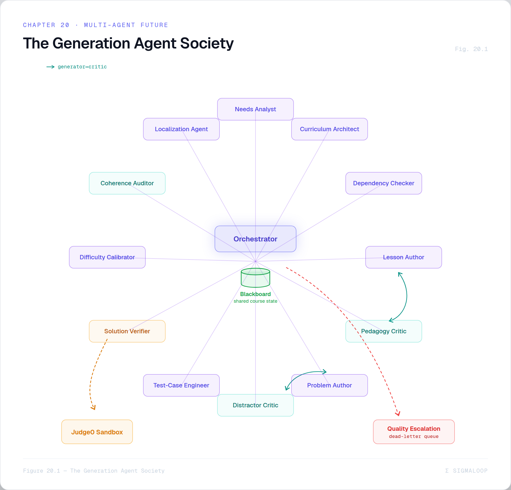
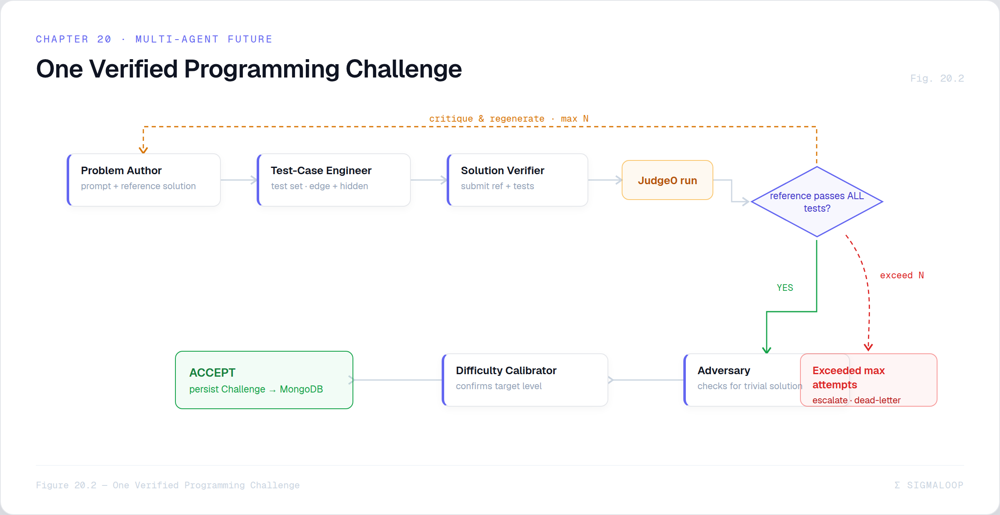

# Chapter 20 — A Society of Agents ★

> *A focus chapter, and a forward-looking one. Today, generation is a handful of single
> prompts. This chapter designs its evolution into a coordinated team of specialized AI
> agents — and explains why that is the natural next step, not gold-plating.*

## 20.1 Where we are, and why it's not enough

The pipeline in Chapter 12 is a small number of **monolithic prompts**: one call writes a
course outline, one writes a lesson body, one writes a whole challenge (prompt + starter +
reference solution + test cases, all at once), one grades math. It works, and the lazy-stub
architecture makes it cheap. But asking a single prompt to do a composite job has three
structural weaknesses:

1. **No verification.** A generated programming challenge is *assumed* correct. Nothing
   confirms that its reference solution actually passes its own test cases, that the
   "hidden" tests are right, or that the problem is even solvable as stated.
2. **No specialization.** Designing a good problem, engineering thorough test cases,
   writing clear prose, and calibrating difficulty are *different skills*. One prompt doing
   all of them does each of them adequately and none of them excellently.
3. **No critique.** There's no second pass that asks "is this distractor plausible? is this
   lesson actually about one concept? does this problem have an unintended trivial
   solution?" The first draft is the only draft.

The fix is to decompose generation into a **society of specialized agents**, each doing one
job well, coordinated by an orchestrator, checked by critics, and — crucially —
**verified by execution** wherever possible. The current `generateChallenge` call becomes a
*sub-pipeline*.

> 💡 **Design Note — this is the codebase's own trajectory.** The current pipeline already
> distrusts the model structurally (force-pinned kinds, dropped bad test cases, forced
> composition — Chapter 12), already splits artefacts into separate calls (body vs each
> challenge), and already routes hard work to a stronger model (the reasoner — Chapter 11).
> The multi-agent design is those instincts taken to their conclusion: if you're going to
> validate the model's output anyway, make the validation itself intelligent and
> specialized, and close the loop by *executing* what was generated.

## 20.2 The agent roster

A practical decomposition of generation into dedicated agents. Each has a narrow remit, a
focused prompt, and — importantly — its **own model assignment** (§20.6).

*Figure 20.1 — The generation agent society: a central orchestrator coordinating specialist agents (Needs Analyst, Curriculum Architect, Dependency Checker, Lesson Author, Pedagogy Critic, Problem Author, Test-Case Engineer, Solution Verifier, Difficulty Calibrator, Distractor Critic, Coherence Auditor, Localization Agent) around a shared blackboard of course state — with generator→critic loops, the Solution Verifier wired to Judge0, and a dead-letter/escalate path for items that fail their quality gate.*

| Agent | Job | Consumes | Produces |
|-------|-----|----------|----------|
| **Needs Analyst** | turn chat/questionnaire into a structured learner profile | conversation, goals | `LearnerProfile` (level, prereqs, misconceptions, objectives) |
| **Curriculum Architect** | design the lesson graph (topics, order, dependencies, per-lesson objective) | `LearnerProfile` | course outline as a **DAG** |
| **Dependency Checker** | verify the outline has no forward references; prereqs satisfied | outline DAG | validated outline or a list of violations |
| **Lesson Author** | write the teaching body for one lesson | lesson node + neighbours | markdown body |
| **Pedagogy Critic** | review the body for accuracy, "one concept," reading level, examples | body + objective | accept / revise-with-notes |
| **Problem Author** | design one challenge's *problem* (no tests yet) | lesson, spec, difficulty | prompt + reference solution (or canonical/rubric, or stem) |
| **Test-Case Engineer** | engineer thorough test cases incl. edge & hidden | problem + reference solution | test-case set |
| **Solution Verifier** | **run** the reference solution against the tests in Judge0 | challenge + tests | pass/fail report (the quality gate) |
| **Difficulty Calibrator** | estimate realized difficulty; request adjust if off-target | challenge + verifier report | difficulty estimate + revise signal |
| **Distractor Critic** (MCQ) | ensure distractors are plausible and don't telegraph | MCQ draft | accept / revise |
| **Adversary / Red-Team** | find trivial solutions, ambiguities, multiple valid answers | challenge | defect list |
| **Coherence Auditor** | cross-lesson: terminology, no duplicate topics, smooth ramp | whole course | consistency report |
| **Localization Agent** | translate accepted artefacts (Chapter 15) | accepted content | per-language translations |

> 💡 **Design Note — the Test-Case Engineer deserves to be its own agent.** Of all the
> splits, this is the highest-leverage. Today the same prompt that invents a problem also
> invents its tests — so the tests tend to cover exactly the cases the author was already
> thinking about, and miss the edges. A dedicated Test-Case Engineer, given the finished
> problem and reference solution and prompted *only* to break them (empty input, maximum
> size, off-by-one, negative numbers, duplicate elements, the degenerate case), produces
> the adversarial coverage that makes Judge0 grading trustworthy. Separating "design the
> problem" from "try to break the solution" is the difference between tests that confirm
> and tests that *test*.

## 20.3 The headline win: verification by execution

The single most valuable thing a multi-agent pipeline unlocks is a **closed loop for
programming challenges**: generate, then *run*, and only keep what passes.

*Figure 20.2 — One verified programming challenge: Problem Author (prompt + reference solution) → Test-Case Engineer (tests incl. edge + hidden) → Solution Verifier submits the reference solution + tests to Judge0; if it doesn't pass all its own tests, critique + regenerate (max N); if it does, Adversary checks for a trivial solution and the Difficulty Calibrator confirms target before **ACCEPT → persist Challenge** — and exceeding N attempts dead-letters or escalates to a stronger model.*

The flow for one programming challenge:

1. **Problem Author** writes the prompt and a reference solution.
2. **Test-Case Engineer** writes the tests (designed to break the solution).
3. **Solution Verifier** submits the reference solution against those tests to **Judge0**
   (the same sandbox that grades students — Chapter 14).
4. **Gate:** if the reference solution does *not* pass all of its own tests, the
   challenge is internally inconsistent — loop back with the failure as critique and
   regenerate (bounded to *N* attempts).
5. **Adversary** checks for an unintended trivial solution (e.g. "return the input"); the
   **Difficulty Calibrator** confirms the realized difficulty matches the target.
6. **Accept** only a challenge that survives all gates; otherwise dead-letter it or
   escalate to a stronger model.

> 💡 **Design Note — "AI-generated" becomes "AI-generated *and verified*."** Today, a
> generated programming challenge is trusted on faith. With the verifier in the loop, the
> system *executes the reference solution against the generated tests before a student
> ever sees it* — so a challenge that ships is one whose own answer demonstrably passes its
> own grader. This is the same trick the math grading already uses in spirit (a canonical
> solution to grade against), applied to authoring, and it eliminates the worst failure
> mode of AI-generated coding problems: a "correct" answer that the test cases reject. For
> math, the analogue is a **Solution Verifier** that re-derives or symbolically checks the
> canonical solution against the rubric before accepting.

## 20.4 The orchestration pattern

Three coordination patterns compose the society:

- **Orchestrator + specialists + blackboard.** A lightweight orchestrator advances a
  **structured course state** (the "blackboard"): `LearnerProfile → outline DAG → per-lesson
  {body, challenges[]}`. Each agent reads the part it needs and writes its result back. The
  blackboard is the contract; agents don't call each other directly.
- **Generator–Critic loops.** Each authoring agent is paired with a critic (Lesson Author
  ↔ Pedagogy Critic, MCQ Author ↔ Distractor Critic, Problem Author ↔ Adversary). The
  author drafts; the critic accepts or returns specific notes; the author revises — bounded
  to a few rounds, then the best draft is taken. This is the actor–critic idea applied to
  content.
- **Fan-out / fan-in.** The orchestrator maps lesson generation across the outline and
  challenge generation across a lesson's specs, exactly as the lazy pipeline already does
  (`Promise.all`) — but now each item is itself a critic-checked, verified sub-pipeline.

This maps cleanly onto the AWS design (Chapter 17): the blackboard is the Step Functions
execution state, each agent is a Lambda, generator–critic loops are `Choice`/retry states,
fan-out is the `Map` state, and the Solution Verifier is a Lambda that calls the Judge0
ALB. The migration to multi-agent is largely *adding states to a state machine you already
planned to build.*

## 20.5 Quality gates, escalation, and cost control

A society of agents only improves on a single prompt if it knows when to stop and when to
give up:

- **Bounded loops.** Every generator–critic and generate-verify loop has a hard attempt
  cap (the worker already retries 4× — Chapter 12; here the cap is per sub-pipeline).
- **Quality gates.** An artefact advances only if it passes its gate (verifier green,
  critic accept, difficulty on-target). A persistent failure is **dead-lettered** to a
  `failed_generations` store and surfaced, never silently shipped — the same dead-letter the
  AWS proposal already specifies.
- **Escalation.** When agents disagree, or an item fails its gate repeatedly, escalate:
  re-run the authoring step on a **stronger model** (the reasoner, or a frontier SaaS
  model), and if it still fails, flag for human review. This is the multi-agent version of
  the math grader's confidence gate (Chapter 14) — uncertainty is routed up, not papered
  over.
- **Laziness still applies.** The whole society runs **per lesson, on first open** — the
  lazy-stub model (Chapter 12) is unchanged, so the extra agents cost nothing for lessons a
  learner never reaches. The cost of a richer pipeline is paid only on material that is
  actually consumed.

> 💡 **Design Note — more agents need not mean more money.** A naive reading is that ten
> agents cost ten times one prompt. But the agents are *not all the same model* (§20.6),
> most are cheap, the expensive ones run rarely (only the authors, and only the verifier's
> Judge0 call has real compute), and laziness means the whole pipeline runs only for opened
> lessons. The right comparison isn't "1 prompt vs 10 agents" — it's "1 unverified prompt
> vs a verified, critic-checked artefact," and the second is worth a few cheap extra calls.

## 20.6 Specialization includes the *model*, not just the prompt

The deepest form of specialization is assigning each agent the model that fits its job —
which the `AIClient` abstraction (Chapter 11) and the self-hosted option (Chapter 19) make
trivial:

| Agent | Suggested model | Why |
|-------|-----------------|-----|
| Needs Analyst, Coherence Auditor | cheap base model | summarization / consistency — bounded, cheap |
| Curriculum Architect, Problem Author (hard) | **reasoner / frontier model** | open-ended design where quality is hardest |
| Test-Case Engineer | **code-tuned model** (e.g. self-hosted Qwen-Coder) | adversarial test design is a coding skill |
| Lesson Author, MCQ Author | cheap base model | structured prose with clear rules |
| Critics (Pedagogy, Distractor, Adversary) | cheap base model | evaluation against a checklist is easier than creation |
| Solution Verifier | **no model — Judge0** | it executes; it doesn't reason |
| Localization Agent | cheap base model | translation, already pinned to the fast model (Chapter 15) |

> 💡 **Design Note — the verifier isn't a model at all.** The most reliable agent in the
> society runs no LLM: the Solution Verifier is a deterministic execution against Judge0.
> The lesson of Chapter 14 — confine machine judgement to where it's irreplaceable — applies
> here too. Wherever a generated artefact can be *checked by running it* rather than *judged
> by another model*, do that; reserve the (more expensive, less certain) LLM critics for the
> things that genuinely require taste.

## 20.7 A pragmatic migration path

This is not a rewrite; it's an incremental series, each step independently valuable:

1. **Add the Solution Verifier first.** Wrap the *existing* `generateChallenge` with a
   Judge0 run of the reference solution against the generated tests; on failure, regenerate.
   This single change turns unverified programming challenges into verified ones — the
   biggest quality jump for the least work.
2. **Split out the Test-Case Engineer.** Let the problem author write only the problem; a
   dedicated agent writes adversarial tests against the finished reference solution.
3. **Add critics** (Pedagogy, Distractor, Adversary) as bounded generator–critic loops
   around the existing authors.
4. **Promote the outline to an Architect + Dependency Checker** that produce and validate a
   lesson DAG rather than a flat list.
5. **Introduce the Orchestrator + blackboard** to make the whole thing explicit, and move
   it onto Step Functions in production (Chapter 17).
6. **Per-agent model routing** — assign each agent its ideal model (§20.6), including the
   self-hosted code model for test engineering.

Each step is shippable on its own, each is gated and reversible (the same shadow-then-cut
discipline as the AWS migration — Chapter 17), and each moves the pipeline from "a clever
prompt" toward "a small, specialized, self-checking content studio."

## 20.8 The thesis

SigmaLoop already treats the model as an *untrusted component to be validated*. The
multi-agent generation pipeline is that philosophy made into an architecture: decompose
the work so each agent does one thing well, pair every author with a critic, **verify by
execution wherever you can**, escalate uncertainty to stronger models or to humans, and
keep it all lazy so you pay only for what learners consume. The result is content that is
not merely *generated* but *generated, critiqued, executed, and calibrated* — which, for a
tutor whose entire value is the quality of what it teaches, is the whole game.

This closes the book's main body. The appendices follow: the API and environment
references, a glossary, and the index of every figure still to be produced.
