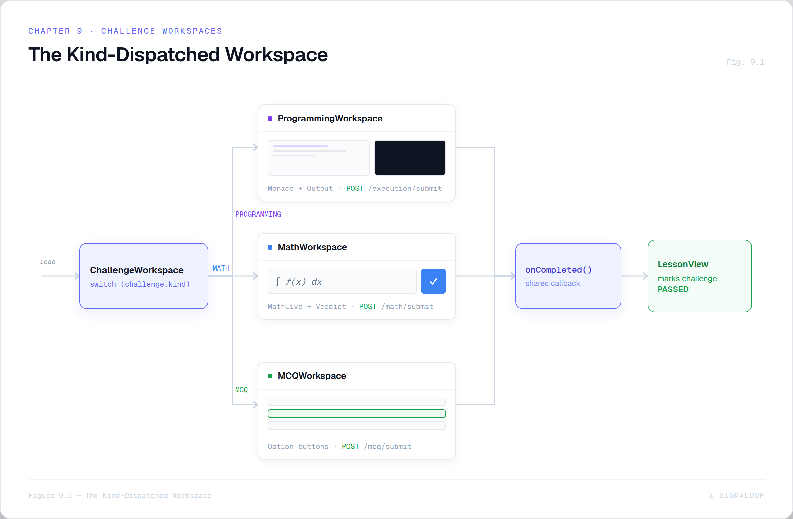

# Figures, Screenshots & Diagrams

This folder holds the rendered image assets for the documentation. The book itself
ships with **placeholders** (so the prose stays diff-able and reviewable in git); this
file defines the convention and the workflow for turning a placeholder into a real
image.

There are two kinds of figure.

---

## 1. Screenshots — 📸

Captured from the running application. In the text they appear as:

```markdown
> 📸 **FIGURE 9.1 — Lesson workspace (PROGRAMMING mode)**
> *Screenshot placeholder.* **Capture:** `/lessons/:id` with the Monaco editor on the
> left and the Output panel showing a passed/failed test run on the right.
```

To fulfil one:

1. Run the stack (see Chapter 16).
2. Navigate to the route, reproduce the described state.
3. Save the screenshot here as `figure-09-1.png` (zero-padded chapter & figure).
4. Replace the blockquote with:
   ```markdown
   
   *Figure 9.1 — Lesson workspace (PROGRAMMING mode).*
   ```

---

## 2. Diagrams — 🎨

Generated from a written prompt with an image model (Claude image generation /
"Claude design"). In the text they appear as:

```markdown
> 🎨 **FIGURE 2.1 — The four-layer architecture**
> *Diagram — generate with Claude image generation.* **Prompt:**
> "A clean technical architecture diagram on a dark navy background, four stacked
> horizontal layers labelled Client / Edge / Application / Data…"
```

The **prompt is already written** in every diagram placeholder — you don't have to
invent it. To fulfil one:

1. Copy the prompt verbatim into the image model.
2. Iterate until it matches the description.
3. Save as `figure-02-1.png` here.
4. Replace the blockquote with a normal image embed (as above).

Several chapters also reference **Mermaid** diagrams that already exist as source text
inside the `Hosting SigmaLoop/README.md` proposal. Those can be rendered directly with
`mermaid-cli` (`mmdc`) or any Mermaid live editor instead of an image model — the book
notes which is which.

---

## Brand palette (use for all diagrams)

Keep diagrams consistent with SigmaLoop's identity (from `architecture-diagram-spec.md`):

| Element | Colour | Hex |
|---------|--------|-----|
| Background | Dark navy | `#0a0e1a` / `#1a1a2e` |
| Client / SPA layer | Teal / cyan | `#2dd4bf` |
| Edge / proxy layer | Gray | `#6b7280` |
| Application / backend | Indigo / purple | `#7c3aed` (brand accent: `#6366f1`) |
| MongoDB / DocumentDB | Green | `#22c55e` |
| AI provider (DeepSeek/Gemini) | Blue | `#3b82f6` |
| Judge0 | Orange | `#f59e0b` |
| Arrows / labels | Light gray | `#e5e7eb` |

Conventions: rounded rectangles for services, cylinders for databases, a cloud shape
for external SaaS APIs, arrows labelled with the data that flows. The two grading paths
(Judge0 vs LLM) and the async generation pipeline are the diagrams worth making most
legible — they are what make the architecture distinctive.

---

## Index

Every figure in the book — screenshot or diagram — is listed in
[`../book/appendix-d-figures.md`](../book/appendix-d-figures.md) with its number, type,
chapter, and one-line description. That appendix is the checklist for "what art still
needs producing."
